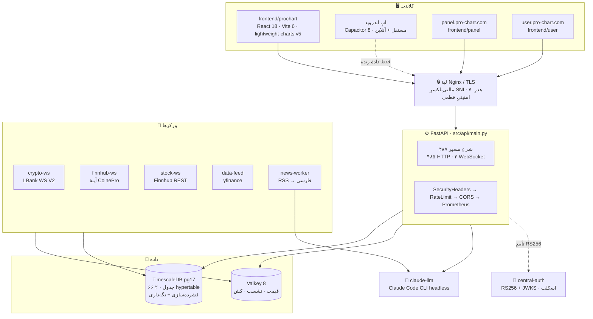
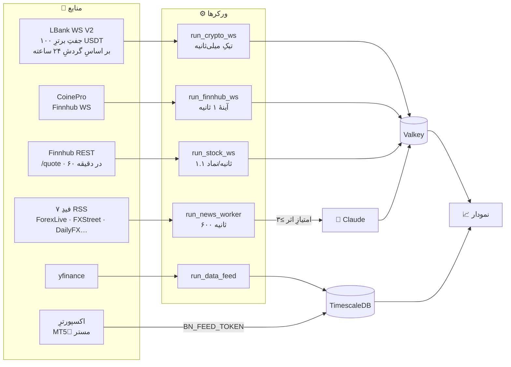
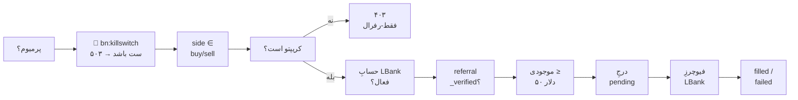

<div align="center">



<br>

**ترمینالِ معاملاتیِ فارسی‌محور و راست‌به‌چپ — نمودار، تحلیل و اجرا، برای کسانی که TradingView هرگز برایشان بومی‌سازی نکرد.**

<br>

[](docs/EXECUTION_STATE.md)
[](docs/03_REQUIREMENTS_MATRIX.csv)
[](Dockerfile)
[](frontend/prochart/package.json)
[](#-مجوز-و-سلب-مسئولیت)

<br>

### 🌐 &nbsp; [English](README.md) &nbsp;·&nbsp; **فارسی**

<br>


</div>

<br>

> [!IMPORTANT]
> **پیش از قضاوت دربارهٔ این ریپو، بخشِ وضعیت را بخوانید.** بازارنما در حالِ ساخت و در **فاز ۰ (Baseline)** است — ۶ الزام از ۱۶۲ به‌طور رسمی `VERIFIED` شده، مجموعهٔ تست پایتون قرمز است، و Gateِ کارایی رد می‌شود. موتورِ نمودار عمیق و واقعی است؛ پلتفرمِ پیرامونش تمام نشده. این README آنچه را که کد **انجام می‌دهد** مستند می‌کند، نه آنچه یک ارائهٔ تبلیغاتی ادعا می‌کرد. هر عددِ زیر تا یک فایل قابلِ ردیابی است.

<br>

## 📖 فهرست

<table>
<tr><td>

- [این چیست](#-این-چیست)
- [جواهراتِ پروژه](#-جواهراتِ-پروژه)
- [معماری](#-معماری)
- [جریانِ داده](#-جریانِ-داده)
- [استکِ فنی](#-استکِ-فنی)

</td><td>

- [موتورِ نمودار](#-موتورِ-نمودار)
- [نمااسکریپت](#-نمااسکریپت)
- [اندیکاتورها](#-اندیکاتورها-۱۰۸)
- [ابزارهای ترسیم](#️-ابزارهای-ترسیم-۱۰۰)
- [ترید و انطباق](#️-ترید-و-انطباق)

</td><td>

- [امنیت](#-امنیت)
- [وضعیتِ پروژه](#-وضعیتِ-پروژه-صادقانه)
- [شروع](#-شروع)
- [ساختارِ ریپو](#-ساختارِ-ریپو)
- [نقشهٔ راه](#-نقشهٔ-راه--i0i8)

</td></tr>
</table>

<br>

## 🎯 این چیست

**بازارنما** (Pro-Chart) یک پلتفرمِ تحلیل و معامله است که قیدِ بنیادینش غیرمعمول است: **فارسی یک لایهٔ ترجمه نیست، بسترِ کار است.**

کلِ رابط راست‌به‌چپ است. مستندات، کامنت‌های کد، سامانهٔ راهنما و پیام‌های خطا فارسی‌اند. فونت‌ها، قلم‌های فارسیِ خودمیزبان‌اند. عنصرِ `<html>` به‌سختی روی `lang="fa" dir="rtl"` قفل شده و **هرگز** از آن خارج نمی‌شود — حتی وقتی کاربر رابط را انگلیسی می‌کند، فقط `<body>` و `#root` تغییر می‌کنند تا متادیتای عمومی طبقِ قرارداد فارسی بماند.

هدفِ محصول، نقل از [`docs/01_PROCHART_MASTER_SPEC_FA.md`](docs/01_PROCHART_MASTER_SPEC_FA.md):

> ساخت بهترین سامانه تحلیل و معامله برای فارسی‌زبانان … در سطحی بالاتر از TradingView

سه دامنه، یک کدبیس:

| دامنه | چه چیزی را سرو می‌کند | سورس |
|---|---|---|
| `pro-chart.com` | ترمینالِ نمودار + `/api` | `frontend/prochart/` · `src/api/` |
| `panel.pro-chart.com` | پنلِ ادمین | `frontend/panel/` |
| `user.pro-chart.com` | پرتالِ کاربر | `frontend/user/` |

**بازارها:** کریپتو از طریقِ **LBank**، فارکس/فلزات/شاخص‌ها از دادهٔ **وان‌رویال (MT5)**، سهام/ETF از **Finnhub + yfinance**.

<br>

## 💎 جواهراتِ پروژه

این‌ها بخش‌هایی‌اند که ارزشِ خواندنِ سورس را دارند. هر کدام مهندسیِ واقعی و قابلِ راستی‌آزمایی است — نه یک آیتمِ نقشهٔ راه.

<br>

<details open>
<summary><b>🧬 &nbsp;دو موتورِ اسکریپتِ مستقل، هر دو سندباکس‌شده در Web Worker</b></summary>

<br>

**نمااسکریپت** معادلِ داخلیِ Pine Script است. با **دو رانتایمِ جدا و قراردادِ خروجیِ یکسان** عرضه می‌شود — طراحیِ واقعاً غیرمعمولی:

| موتور | فایل | مدل | چرا وجود دارد |
|---|---|---|---|
| **برداری** | [`namascript.js`](frontend/prochart/src/bazaarnama/namascript.js) (۲۴۰ خط) | هر سری یک آرایه است. `ta.*` آرایه برمی‌گرداند. بدنه **یک‌بار** و عنصر-به-عنصر اجرا می‌شود. | سریع. مناسبِ اندیکاتورهایی که کلِ تاریخچه معلوم است. |
| **VMِ کندل‌به‌کندل** | [`namascript_bar.js`](frontend/prochart/src/bazaarnama/namascript_bar.js) (۴۲۰ خط) | بدنه **به‌ازای هر کندل، از چپ به راست** اجرا می‌شود. کلاسِ `Series` شاملِ `hist[]` + `cur` است تا `s.get(n)` عملگرِ تاریخچه باشد. | سمانتیکِ واقعیِ Pine. برای `var`/`varip`، انتساب `:=` و `barstate.*` لازم است. |

VMِ کندل‌به‌کندل یک مسئلهٔ ظریف را درست حل می‌کند: **Pine به هر محلِ فراخوانیِ `ta.sma(...)` وضعیتِ غلتانِ مستقلِ خودش را می‌دهد.** این VM با `TA_STATE`ِ ماندگارِ به‌ازای هر محلِ فراخوانی پیاده‌اش کرده — همان چیزی که اکثرِ کلون‌های Pine اشتباه می‌کنند.

هر دو **جایگزینِ مستقیمِ یکدیگرند**. هر دو همان ۱۵ سطل را تولید می‌کنند: `plots, shapes, hlines, bgs, labels, alerts, inputs, zones, fills, lines, boxes, tables, barcolors, candleplots, strategy`.

هر دو کدِ کاربر را در یک **Web Worker بدونِ DOM، بدونِ شبکه و با timeout** اجرا می‌کنند — سندباکس ساختاری است، نه توصیه‌ای.

</details>

<details>
<summary><b>🔤 &nbsp;پارسرِ بازگشتیِ دست‌نویس برای نمادهای ترکیبی</b></summary>

<br>

[`symbolExpr.js`](frontend/prochart/src/bazaarnama/symbolExpr.js) (۱۰۹ خط) نمادهای مصنوعیِ سبکِ TradingView را پیاده می‌کند — `EURUSD/GBPUSD`، `XAUUSD*2`، `US30-US500`، `(BTCUSDT+ETHUSDT)/2` — با **توکنایزر به‌علاوهٔ یک پارسرِ بازگشتیِ واقعی** (`parseExpr` ← `parseTerm` ← `parseFactor`) که AST می‌سازد. بدونِ `eval`، بدونِ وابستگی.

جزئیاتی که دقت را نشان می‌دهد: `computeSpread()` عبارت را **مستقلاً روی هر یک از open/high/low/close** ارزیابی می‌کند، سپس:

```js
high = بیشینهٔ چهار گوشهٔ محاسبه‌شده
low  = کمینهٔ چهار گوشهٔ محاسبه‌شده
```

…چون وقتی یک **نسبت** معکوس می‌شود، نگاشتِ ساده‌لوحانهٔ `high/high` و `low/low` باعثِ `high < low` می‌شود و نمودار می‌شکند. این باگی است که اکثرِ پیاده‌سازی‌ها با آن عرضه می‌شوند.

</details>

<details>
<summary><b>🎨 &nbsp;یک Primitiveِ رندرِ سفارشی برای lightweight-charts v5</b></summary>

<br>

[`bandFill.js`](frontend/prochart/src/bazaarnama/bandFill.js) (۷۶ خط) یک wrapper نیست — یک **`BandFillPrimitive` + `BandFillPaneView` + `BandFillRenderer`**ِ واقعی است که رابطِ Primitiveِ lightweight-charts v5 را در `zOrder: 'bottom'` و فضای مختصاتِ media پیاده می‌کند.

ناحیهٔ بینِ دو خط را پر می‌کند (باندهای بولینگر/کلتنر، ابرِ ایچیموکو). وقتی `colorDown` داده شود، ناحیه را به زیربخش‌هایی می‌شکند که با `upper >= lower` رنگ می‌گیرند — و ابرِ ایچیموکو دقیقاً همین‌طور در نقطهٔ تقاطع رنگ عوض می‌کند.

کلش در `try/catch` پیچیده شده تا بدترین خرابیِ ممکن **یک fillِ غایب** باشد، نه یک نمودارِ کرش‌کرده.

</details>

<details>
<summary><b>📊 &nbsp;پروفایلِ حجمی که حجم را همان‌طور توزیع می‌کند که TradingView واقعاً می‌کند</b></summary>

<br>

[`volumeProfile.js`](frontend/prochart/src/bazaarnama/volumeProfile.js) (۳۷ خط، صفر import) حجمِ هر کندل را **به‌طور یکنواخت روی هر سطلِ قیمتی که بازهٔ high–low آن را می‌پوشاند** پخش می‌کند — نه فقط در سطلِ حاویِ میانه. **POC** (سطلِ بیشینه‌حجم) و **ناحیهٔ ارزشِ ۷۰٪** را با گسترشِ دوطرفه‌ای که همیشه همسایهٔ سنگین‌تر را اول برمی‌دارد محاسبه می‌کند.

برای ابزارهای بدونِ حجم (فارکس) `w = 1` می‌گذارد و به‌جای رندرنکردن، با ظرافت به **پروفایلِ TPO / شمارشِ کندل** تنزل می‌کند.

صفر import یعنی مستقیماً با Node تست‌پذیر است — [`test/volumeProfile.test.mjs`](frontend/prochart/test/volumeProfile.test.mjs).

</details>

<details>
<summary><b>🤖 &nbsp;Claude Code CLI به‌عنوان سایدکارِ LLM — ۸۰ خط، صفر وابستگیِ npm</b></summary>

<br>

[`llm_service/`](llm_service/) یک wrapperِ HTTP روی **Claude Code CLI در حالتِ headless** است که با اشتراکِ Maxِ میزبان احراز هویت می‌شود، نه با صورت‌حسابِ توکنیِ API. دستورِ `claude -p <prompt> --output-format json --model <model>` را spawn می‌کند و نتیجه را برمی‌گرداند. فقط از `http` و `child_process`ِ داخلیِ Node استفاده می‌کند — **هیچ وابستگیِ npm ندارد**.

نکتهٔ هوشمندانه: وقتی `system` داده شود، `--system-prompt` **به‌علاوهٔ `--exclude-dynamic-system-prompt-sections`** را اضافه می‌کند و systemprompt را به یک **جایگزینیِ کامل** تبدیل می‌کند. هویتِ پیش‌فرضِ «دستیارِ کدنویسی»ِ Claude Code کاملاً حذف می‌شود تا نقشی مثلِ *«متخصصِ بازارهای مالی»* بدونِ باقی‌مانده اعمال شود.

کلاینتِ پایتون ([`src/llm/client.py`](src/llm/client.py)) بر یک اصل ساخته شده که در docstringش آمده — **تنزلِ امن**: در خطا، timeout یا خاموش‌بودنِ فلگ، `None` برمی‌گرداند و فراخوان به مسیرِ بدونِ LLM برمی‌گردد. هرگز بلاک نمی‌کند و هرگز مسیرِ اصلی را نمی‌شکند.

</details>

<details>
<summary><b>⛓️ &nbsp;راستی‌آزماییِ بی‌اعتمادِ پرداختِ USDT بدونِ کلیدِ API</b></summary>

<br>

[`_bsc.py`](src/api/routes/_bsc.py) (۸۰ خط) پرداختِ اشتراک را **مستقیماً روی زنجیرهٔ BSC** و از طریقِ چهار RPCِ عمومی با fallback راستی‌آزمایی می‌کند — بدونِ کلیدِ Etherscan، بدونِ درگاهِ شخصِ ثالث، بدونِ اعتماد.

`verify_usdt_payment()` رسید را می‌گیرد، `status == 0x1` را الزام می‌کند، سپس در لاگ‌ها دنبالِ موردی می‌گردد که **هر سه** برقرار باشند:

- `address == 0x55d398326f99059ff775485246999027b3197955` (Binance-Peg BSC-USD)
- `topics[0] == 0xddf252ad...` (امضای `Transfer(address,address,uint256)`)
- ۲۰ بایتِ آخرِ `topics[2]` == کیفِ ما

…سپس `data` را دیکد و بر **1e18** تقسیم می‌کند. همین ثابتِ آخر تله است: BSC-USD **۱۸** رقمِ اعشار دارد، برخلافِ **۶**ِ USDTِ TRC20/ERC20. اشتباهِ ۱۰¹² یک باگِ خاموش و فاجعه‌بار است — و کد درستش را دارد.

</details>

<details>
<summary><b>🧪 &nbsp;هارنسِ QA با شواهدِ مهروموم‌شده و دست‌کاری‌آشکار</b></summary>

<br>

درختِ [`qa/`](qa/) خروجیِ تست را **شاهد** می‌داند، نه لاگ. از [`qa/README.md`](qa/README.md):

- اجراهای مرجع در کانتینرِ پین‌شده (`mcr.microsoft.com/playwright:v1.61.0-noble`) با **مانتِ فقط-خواندنیِ ریپو** انجام می‌شوند.
- `forbidOnly: true`، **`retries: 0`**، `workers: 1` — بدونِ پول‌شوییِ flakiness.
- دقیقاً **یک** درخواستِ ناهم‌توان مجاز است (`POST /api/academy/auth/bn-guest`). هر نوشتنِ شبکه‌ایِ دیگر شکست است.
- **هیچ‌گاه *مقدارِ* storage یا کوکی در artifact نوشته نمی‌شود** — فقط نامِ کلید و متادیتای کوکی؛ مقادیرِ query-string ویرایش می‌شوند.
- Artifactها با `SHA256SUMS` مهر می‌شوند.

و قاعده‌ای که بقیه را معنادار می‌کند:

> retry، exclusion یا mask برای سبزکردن Gate ممنوع است.

</details>

<br>

## 🏗 معماری



استکِ مرجع [`docker-compose.prochart.yml`](docker-compose.prochart.yml) است — **۱۱ سرویس**، نامِ پروژه `prochart`، هر سرویس با محدودیتِ منابع.

> [!NOTE]
> **دو فایلِ compose هم‌پوشان وجود دارد.** فایلِ `docker-compose.yml` استکِ قدیمیِ ~۴۰ سرویسیِ CoinePro FX است (Prometheus، Grafana، Loki، MediaMTX، coturn، MLflow، Prefect…). build contextهای گم‌شده دارد و مسیرِ دیپلویِ بازارنما **نیست**. از `deploy.sh` استفاده کنید، نه `make`. این هم‌پوشانی یک شکافِ ساختاریِ شناخته‌شده است و در [`docs/ARCHITECTURE.md`](docs/ARCHITECTURE.md) مستند شده.

**دو ظرافتِ نام‌گذاریِ سرویس که باید بدانید:**

- سرویسی که `redis` نام دارد **Valkey 8** اجرا می‌کند، نه Redis. عمداً `redis` نامیده شده تا کدِ اپلیکیشن و `.env` نیاز به تغییر نداشته باشند.
- سرویسی که `finnhub-ws` نام دارد **هیچ اتصالی به Finnhub باز نمی‌کند**. قیمت‌های فارکس را با فاصلهٔ ۱ ثانیه از سرویسِ خواهرِ CoinePro آینه می‌کند، چون یک WSِ دومِ Finnhub روی کلیدِ API تداخل می‌کرد. یک منبع، آینه‌شده.

<br>

## 🌊 جریانِ داده



<details>
<summary><b>نقشهٔ کلیدهای Redis/Valkey</b></summary>

<br>

| کلید | نویسنده | TTL | محتوا |
|---|---|---|---|
| `bn:cprice:{SYM}` | `run_crypto_ws` | ۶۰ث | `{bid, ask, mid, ts}` از LBank WS |
| `price:{SYM}` | `run_finnhub_ws` | — | فارکس/فلزات/شاخص، `source="finnhub"` |
| `price:{SYM}` | `run_stock_ws` | ۱۲۰ث | سهام/ETF + `prevClose`، `source="finnhub-stock"` |
| `bn:crypto_top100` | `run_crypto_ws` | — | set، برای هرسِ کاتالوگ |
| `bn:fxsyms` | `POST /feed/forex` | — | setِ نمادهای فارکس |
| `bn:news` | `run_news_worker` | ۷۲۰۰ث | خلاصه‌های فارسی |
| `bn:calendar` | `run_news_worker` | ۲۱۶۰۰ث | تقویمِ اقتصادی، ترجمه‌شده |
| `bn:killswitch` | ادمین | — | **وجودش کلِ اجرا را متوقف می‌کند (۵۰۳)** |
| `bn:cbal:{sid}` | `bn_gate` | ۶۰ث | موجودیِ کش‌شدهٔ LBank |
| `token_blacklist:{jti}` | `/auth/logout` | — | JWTهای باطل‌شده |

**خطِ لولهٔ اخبار یک ویژگیِ خوب دارد:** اگر ترجمهٔ Claude شکست بخورد، **کشِ قبلی را نگه می‌دارد** به‌جای تنزل به انگلیسی. یک خلاصهٔ فارسیِ کهنه بهتر از یک خارجیِ تازه است.

</details>

<br>

## 🛠 استکِ فنی

<table>
<tr><th align="right">لایه</th><th align="right">انتخاب</th><th align="right">توضیح</th></tr>
<tr><td><b>نمودار</b></td><td><code>lightweight-charts</code> v5</td><td>+ یک Primitiveِ رندرِ سفارشی</td></tr>
<tr><td><b>فرانت‌اند</b></td><td>React 18.3 · Vite 6 · Zustand 5 · TanStack Query 5</td><td>Tailwind 3.4، بدونِ کتابخانهٔ کامپوننت — همه‌چیز دست‌ساز</td></tr>
<tr><td><b>موبایل</b></td><td>Capacitor 8 · بیومتریکِ نیتیو</td><td>APK در CI ساخته می‌شود، مستقل + آنلاین</td></tr>
<tr><td><b>API</b></td><td>FastAPI 0.139 · Starlette 1.3 · uvicorn</td><td>۴۸۷ شیءِ مسیر، ۲ ورکر</td></tr>
<tr><td><b>رانتایم</b></td><td>Python 3.13.14 (ایمیجِ پین‌شده با digest)</td><td><code>pyproject.toml</code> هدفِ ۳.۱۲+ دارد؛ ایمیج ۳.۱۳ است</td></tr>
<tr><td><b>ORM</b></td><td>SQLAlchemy 2.0 async · asyncpg · Alembic</td><td>۶۶ مدل · ۴۱ مهاجرتِ خطی · head <code>041_bn_ai_signals</code></td></tr>
<tr><td><b>دیتابیس</b></td><td>TimescaleDB pg17</td><td>hypertable روی <code>candles</code>+<code>ticks</code>؛ فشرده‌سازی ۳۰ روزه، نگه‌داری ۲ ساله</td></tr>
<tr><td><b>کش</b></td><td>Valkey 8</td><td>۱ گیگ، allkeys-lru، appendonly، requirepass</td></tr>
<tr><td><b>احراز هویت</b></td><td>PyJWT · bcrypt · Fernet</td><td>اول RS256ِ مرکزی ← fallback به HS256</td></tr>
<tr><td><b>LLM</b></td><td>Claude Code CLI headless</td><td>سایدکارِ ۸۰ خطی، صفر وابستگیِ npm</td></tr>
<tr><td><b>تحلیلِ تکنیکال</b></td><td>TA-Lib 0.7 · NumPy 2.2 · pandas 2.2</td><td>بک‌اند؛ رجیستری‌های فرانت JSِ مستقل‌اند</td></tr>
<tr><td><b>QA</b></td><td>Playwright 1.61 · axe-core 4.10 · pytest</td><td>دسکتاپ ۱۴۴۰×۹۰۰ + موبایل ۳۹۰×۸۴۴</td></tr>
</table>

<br>

## 📈 موتورِ نمودار

فایلِ [`frontend/prochart/src/pages/BazaarNama.jsx`](frontend/prochart/src/pages/BazaarNama.jsx) با **۴٬۰۸۴ خط** حدودِ ۴۵ ماژول را ترکیب می‌کند. در [`AppShell.jsx`](frontend/prochart/src/app/AppShell.jsx) **دائماً mount می‌ماند** — هر صفحهٔ دیگر رویش overlay می‌شود، پس نمودار هرگز دوباره init نمی‌شود.

### انواعِ نمودار

**استاندارد:** کندل · کندلِ توخالی · بار · خطی · ناحیه‌ای · baseline · پله‌ای · ناحیهٔ HLC · ستونی · سقف-کف · خطی با نشانگر · کندلِ حجمی · هیکین‌آشی

**غیراستاندارد** (از کندلِ خام بازسازی می‌شوند در [`chartbuilders.js`](frontend/prochart/src/bazaarnama/chartbuilders.js)): **رنکو · رنج · لاین‌بریک · کاگی · نقطه و شکل**

### قابلیت‌ها

<table>
<tr><td width="50%" valign="top">

**تحلیل**
- ۱۰۸ اندیکاتور در ۳ رجیستری
- ~۱۰۰ ابزارِ ترسیم، لنگرانداخته در فضای نمودار
- چند-تایم‌فریم (`mtfEma`، `mtfRsi`)
- واگرایی، الگوهای هارمونیک، گپ‌ها
- پروفایلِ حجمی با POC + ۷۰٪ VA
- ریتینگِ تکنیکالِ TradingView (۱۵ MA + ۱۳ اسیلاتور)
- نمادهای ترکیبی/نسبتی از طریقِ AST

</td><td width="50%" valign="top">

**گردشِ کار**
- **بازپخشِ** تاریخی با نردبانِ سرعت
- تسترِ استراتژی در داکِ پایین
- چیدمان‌های آماده: ۱ / ۲ افقی / ۲ عمودی / ۳ / ۴ / ۶ / ۸ با گذرگاهِ همگام‌سازی
- سازندهٔ هشدار: منبع × عملگر × تریگر × انقضا × تحویل
- پنل‌های غربالگر · جزئیات · اخبار · تقویم
- undo/redo، انتخابِ چندتایی (`Ctrl+click`)، سبکِ پیش‌فرضِ هر ابزار
- رجیستریِ اعلانیِ کلیدهای میان‌بر

</td></tr>
</table>

### تایم‌فریم‌های مشتق — و باگی که شکلشان داد

[`resample.js`](frontend/prochart/src/bazaarnama/resample.js) تایم‌فریم‌های M2/M3/H2/H3/W1/MN را از کندل‌های پایه می‌سازد. **دو استراتژیِ متفاوت** به‌کار می‌برد و کامنت دقیقاً می‌گوید چرا:

```js
// درون‌روزی (پایه < ۸۶۴۰۰ ثانیه): سطل‌بندیِ هم‌ترازِ مرزی
Math.floor(t / bucket) * bucket
```

سطل‌بندیِ شمارشی، H2/H3 را به **اولین کندلِ واکشی‌شده** لنگر می‌انداخت و ساعت‌های عجیبی می‌ساخت که **با اسکرول دریفت می‌کردند**. هم‌ترازیِ مرزی این را حل می‌کند.

اما برای پایهٔ روزانه (W1 = D1×۵، MN = D1×۲۲) **شمارشی می‌ماند** — چون «۵ روزِ کاری = ۱ هفته» باید از شکافِ آخرِ هفته جان سالم به‌در ببرد، و هم‌ترازیِ زمانی این را می‌شکند.

<br>

## 🧬 نمااسکریپت

زبانِ اسکریپت‌نویسیِ داخلی. کلیدواژه‌های فارسی، سمانتیکِ سازگار با Pine، دو رانتایمِ قابلِ تعویض.

<details>
<summary><b>توابعِ داخلی — راستی‌آزمایی‌شده در سورس</b></summary>

<br>

**`ta.*`** — `sma · ema · rma · wma · hma · vwma · vwap · stdev · change · mom · roc · highest · lowest · rsi · tr · atr · cci · macd · bb · stoch · supertrend`

**سیگنال** — `crossover · crossunder · cross · rising · falling · barssince · valuewhen · ref`

**فقط در موتورِ کندل‌به‌کندل** — `var` · `varip` · `x := expr` · `close[1]` · `expr[n]` · `barstate.isfirst / islast / isnew / isconfirmed / ishistory` · `na` · `nz`

**سطل‌های خروجی (هر دو موتور)** — `plots · shapes · hlines · bgs · labels · alerts · inputs · zones · fills · lines · boxes · tables · barcolors · candleplots · strategy`

فایل‌های پشتیبان: [`CodeEditor.jsx`](frontend/prochart/src/bazaarnama/CodeEditor.jsx) (۲۹۵) · [`scriptlib.js`](frontend/prochart/src/bazaarnama/scriptlib.js) (۷۱۱ — نمونه‌ها + مرجع) · [`help/namascript.js`](frontend/prochart/src/bazaarnama/help/namascript.js) (۹۲۴ — مستنداتِ زبان)

</details>

<br>

## 📐 اندیکاتورها (۱۰۸)

سه رجیستری در [`indicators.js:554`](frontend/prochart/src/bazaarnama/indicators.js) با `Object.assign(REGISTRY, EXT_REGISTRY_A, EXT_REGISTRY_B)` ادغام می‌شوند. حسابش می‌شود ۵۲ + ۱۶ + ۴۳ = ۱۱۱، اما `trix`، `bbpercent` و `bbw` در هر دو افزونه هستند، پس **رجیستریِ ادغام‌شده ۱۰۸ اندیکاتورِ متمایز دارد** — یعنی `Object.keys(REGISTRY).length`، راستی‌آزمایی‌شده در زمانِ اجرا، نه شمرده‌شده با دست.

<details>
<summary><b>رجیستریِ اصلی — ۵۲ کلیدِ بازمانده</b> &nbsp;·&nbsp; <code>indicators.js</code></summary>

<br>

`ma` `ema` `wma` `hma` `vwap` `avwap` `choppiness` `vortex` `dpo` `bop` `eom` `elderRay` `chandeKroll` `massIndex` `coppock` `kst` `alligator` `rvi` `bbWidth` `stc` `netVolume` `stdErrBands` `accelerator` `chaikinVol` `mtfEma` `mtfRsi` `bb` `supertrend` `rsi` `macd` `stoch` `atr` `cci` `willr` `obv` `adx` `donchian` `keltner` `ichimoku` `dema` `tema` `vwma` `psar` `pivots` `aroon` `mfi` `cmf` `stochrsi` `ao` `tsi` `cmo` `alma` `maRibbon` `gmma` `maCross`

</details>

<details>
<summary><b>افزونهٔ A — ۱۶</b> &nbsp;·&nbsp; <code>indicators_ext_a.js</code></summary>

<br>

`smma` `zlema` `kama` `t3` `mcginley` `linreg` `lsma` `trix` `bbpercent` `bbw` `stddev` `envelopes` `hv` `chaikinVol` `dmi` `ppo`

</details>

<details>
<summary><b>افزونهٔ B — ۴۳</b> &nbsp;·&nbsp; <code>indicators_ext_b.js</code></summary>

<br>

`aroonOsc` `pvo` `adr` `median` `typicalPrice` `weightedClose` `woodiesCci` `pmo` `pvi` `nvi` `rviVol` `mom` `chandelier` `volatilityStop` `ulcer` `roc` `trix` `ac` `uo` `fisher` `crsi` `smiErgodic` `smi` `bop` `bbpercent` `bbw` `volume` `adline` `chaikinOsc` `eom` `forceIndex` `klinger` `pvt` `volumeOsc` `pivotsMulti` `pivotHL` `fractals` `candlePatterns` `zigzag` `autoFib` `srLevels` `supplyDemand` `linRegChannel`

</details>

> **نکته‌ای دربارهٔ دقتِ عددی.** فایلِ [`indicators.js:349`](frontend/prochart/src/bazaarnama/indicators.js) مستند می‌کند که `dema`/`tema` پیش‌تر `null → 0` می‌کردند، EMAهای تودرتو را با صفرهای جعلی seed می‌کردند و تقریباً **۹۰ کندلِ ابتدایی را به‌شدت غلط** می‌ساختند. کامنت‌های این فایل به‌طورِ مداوم *باگی که انگیزهٔ اصلاح بوده* را ثبت می‌کنند، نه صرفاً خودِ اصلاح را. فایلِ [`techRating.js`](frontend/prochart/src/bazaarnama/techRating.js) به مسائلِ هم‌ترازیِ زندهٔ TradingView شمارهٔ **#263/#264/#265** ارجاع می‌دهد — مثلاً ADX مبتنی بر تقاطع است، نه `ADX > 20`، و VWMA روی فارکسِ بدونِ حجم حذف می‌شود پس `maTot` به‌جای ۱۵ می‌شود ۱۴.

<br>

## ✏️ ابزارهای ترسیم (~۱۰۰)

فایلِ [`drawings.js`](frontend/prochart/src/bazaarnama/drawings.js) (۸۰۱) یک overlayِ Canvas را در **فضای نمودار** (`{t: unix, p: price}`) رندر می‌کند، پس ترسیم‌ها زیرِ زوم و pan به داده قفل می‌مانند. فایلِ [`drawtools_ext.js`](frontend/prochart/src/bazaarnama/drawtools_ext.js) (۹۷۰) ۴۳ ابزارِ دیگر را به‌صورتِ رجیستریِ اکیداً افزایشی اضافه می‌کند — هر ابزار **سه تابعِ خالص** روی یک APIِ مختصات است.

<details>
<summary><b>همهٔ گروه‌ها</b></summary>

<br>

| گروه | ابزارها |
|---|---|
| **مکان‌نما** | cursor · select · eraser |
| **خطوط** | trend · ray · infoline · extline · angle · hline · hray · vline · crossline |
| **کانال و چنگال** | channel · regchannel · disjointchannel · flatchannel · pitchfork · schiff · modschiff · insidepitchfork · pitchfan |
| **فیبوناچی** | fib · fibext · fib3 · fibfan · fibtime · fibtimeext · fibchannel · fibcircles · fibarcs · fibspiral · fibwedge |
| **گان** | gannbox · gannsquare · gannfan · gannfixed |
| **الگوها** | xabcd · cypher · abcd · tripattern · threedrives · hns · ell_impulse · ell_triangle · ell_wxyxz · ell_abc · ell_wxy |
| **پیش‌بینی و اندازه‌گیری** | longshort · short · pricerange · daterange · dprange · forecast · ruler · cyclic · sine · projection · timecycles |
| **اشکال** | rect · rotrect · circle · ellipse · triangle · arrow · brush · polyline · path · curve · doublecurve · arc · highlighter |
| **حاشیه‌نویسی** | text · callout · pricelabel · note · arrowdir · flag · signpost · arrowup · arrowdown |

</details>

> [!NOTE]
> از هدرِ `drawtools_ext.js`:
>
> > هیچ کد یا داراییِ اختصاصیِ TradingView استفاده نشده؛ همهٔ فرمول‌ها بازپیاده‌سازی شده‌اند

<br>

## ⚖️ ترید و انطباق

این بخشی است که معمولاً یک README بیش‌فروشی می‌کند. این‌جا آنچه واقعاً اجرا می‌شود:

### کریپتو — LBank

**تنها مسیرِ اجرای زنده**، و پشتِ فلگی است که پیش‌فرض **خاموش** است (`BN_CRYPTO_EXEC_ENABLED`).

سفارش‌ها روی **کلیدِ APIِ خودِ کاربر در LBank** اجرا می‌شوند — هرگز روی حسابِ مستر. زنجیرهٔ گیت در [`bazaarnama.py::real_order`](src/api/routes/bazaarnama.py) سخت‌گیرانه است و هر تلاش، صرف‌نظر از نتیجه، در `bn_orders` ثبت می‌شود:



کلمپِ سمتِ سرور در [`bn_gate.py`](src/api/routes/bn_gate.py) ۲۳ فیلدِ تنظیماتِ کپی را قفل می‌کند: اهرم ۱–۱۲۵، مبلغ ۵–۱۰۰هزار دلار، `margin_mode` **قفل** روی `ISOLATED`، `order_price_type` **قفل** روی مارکت، `product_group` **قفل** روی `SwapU`. فیلدهای `api_key`/`api_secret` صراحتاً رد می‌شوند — فقط از طریقِ `POST /connect/lbank` می‌آیند.

### فارکس — وان‌رویال **فقط-رفرال** است

> [!WARNING]
> **هیچ سفارشِ فارکسی از طریقِ این سیستم قابلِ ثبت نیست.** اجرا عمداً حذف شده و با **پنج قفلِ مستقل** محافظت می‌شود. پیش از فرضِ خلافش، این را بخوانید.

| # | قفل | کجا |
|---|---|---|
| ۱ | `COPY_LIVE_ENABLED = False` با یک `field_validator` به نامِ `_lock_copy_live_off` که **قاطعانه `False` برمی‌گرداند** — *«مقادیرِ قدیمیِ env هرگز نباید آداپتورِ اجرای وان‌رویال را بازکنند.»* **از `.env` قابلِ فعال‌سازیِ مجدد نیست.** | `src/core/config.py` |
| ۲ | `real_order` هر نمادِ غیرکریپتو را با **۴۰۳** رد می‌کند — *«هیچ سفارشِ غیرکریپتو واردِ DB یا صفِ اجرا نمی‌شود.»* | `src/api/routes/bazaarnama.py` |
| ۳ | `GET /copytrade/forex/settings` یک stub بدونِ جست‌وجوی MT5 برمی‌گرداند؛ `POST` → **۴۰۳** | `src/api/routes/bn_gate.py` |
| ۴ | هر مسیرِ تنظیماتِ EA → **۴۱۰ Gone**. روتر اصلاً mount نشده. | `src/api/routes/ea.py` |
| ۵ | `MetaTrader5` در `requirements.txt` کامنت شده؛ `mt5_connector.py` در لیستِ omitِ coverage است | `requirements.txt` |

یک تستِ رگرسیونِ اختصاصی — [`qa/python/legacy_forex_referral_boundary_regression.py`](qa/python/legacy_forex_referral_boundary_regression.py) — برقراریِ این مرز را تضمین می‌کند.

**فارکس هنوز چه می‌کند:** تحلیل کاملاً مستقل از یکپارچگیِ بروکر است. داده از طریقِ `POST /academy/bn/feed/forex` از یک اکسپورترِ MT5ِ مستر می‌آید (احراز هویت با `hmac.compare_digest`)، به‌علاوهٔ آینهٔ `run_finnhub_ws`. کاربران یک **آزمایشِ یک‌بارهٔ ۴۸ ساعته** می‌گیرند، سپس نیاز به اشتراک دارند.

### سطوحِ رفرال

تنها سطحِ بازماندهٔ وان‌رویال [`referrals.py`](src/api/routes/referrals.py) است — ریدایرکت‌های ثابت و عمداً **بدونِ پارامتر**. docstringش می‌گوید یک درخواست نمی‌تواند مقصد را تأمین یا بازنویسی کند، پاسخ هرگز کش نمی‌شود (`Cache-Control: no-store`)، و تحلیلِ رفرالِ آینده **نباید** هدر، query string یا اعتبارنامه ثبت کند.

| مسیر | مقصد |
|---|---|
| `/go/lbank` | `https://www.lbank.com/ref/PROCHART` |
| `/go/oneroyal` | `https://vc.cabinet.oneroyal.com/fa/links/go/12412` |

ثابت‌های `REFERRAL_DISCLOSURE` و `REFERRAL_ELIGIBILITY` افشاگریِ اعتبارِ افیلیت و محدودیتِ اقامتی را حمل می‌کنند.

<br>

## 🔒 امنیت

<table>
<tr><td width="50%" valign="top">

**شکستِ امن، از پایه**
- **احرازِ ادمین**: اگر Redis در دسترس نباشد، بررسیِ لیستِ سیاهِ توکن **۵۰۳ می‌دهد نه اینکه توکن را بپذیرد** — کامنتی صریح می‌گوید این جلوی سوءاستفاده از قطعیِ Redis را می‌گیرد
- **Lifespan**: اپ بدونِ DB و Redis **از بالاآمدن امتناع می‌کند**
- **`/health`**: در پروduction **۵۰۳**ِ fail-closed (۲۰۰ فقط وقتی سالم یا `DEBUG`)
- **`/docs`**: `docs_url = None` مگر `DEBUG` — هیچ UIِ OpenAPI در پروداکشن
- **`/metrics`**: `Depends(get_current_admin)`
- **تنظیمات**: یک `model_validator` در پروداکشن **هنگامِ import خطا می‌دهد** اگر `DB_PASSWORD` / `JWT_SECRET_KEY` / `ADMIN_PASSWORD` ضعیف باشند

</td><td width="50%" valign="top">

**دفاع در عمق**
- اعتبارنامه‌ها **رمزنگاری‌شده با Fernet** در حالِ سکون — DB هرگز متنِ ساده ندارد
- محدودیتِ نرخ به‌ازای IP و مسیر: پیش‌فرض ۲۴۰/۶۰ث؛ `/auth/login` **۵/۶۰ث**
- CORS **هرگز `"*"` نیست** — مبداهای پروداکشن از دامنه‌های پیکربندی‌شده مشتق می‌شوند
- CSPِ `default-src 'none'` روی API؛ `'self'` در لبه، **بدونِ `unsafe-eval`**
- ۷ هدرِ قطعی که در لبه پس از `proxy_hide_header` دوباره اضافه می‌شوند
- کانتینر با کاربرِ **غیرروت** `USER 1000:1000` اجرا می‌شود
- ایمیج‌های پایه **با digest پین‌شده**؛ `pip check` + تستِ دودیِ import هنگامِ build
- gitleaks + bandit + Trivy + hadolint + pip-audit

</td></tr>
</table>

> [!CAUTION]
> **شکاف‌های بازِ امنیتی — بی‌پرده.** فایلِ [`docs/security/SECURITY_REPORT.md`](docs/security/SECURITY_REPORT.md) گیتِ انتشار را **`FAIL`** ثبت کرده است.
>
> - **`PC-132` (چرخش/ابطالِ راز) `FAIL` است** — *تاریخچهٔ* گیتِ baseline هنوز ۱ یافتهٔ کلیدِ APIِ عمومی دارد. به بیانِ خودِ گزارش: *«exposure قبلی با حذف artifact خنثی نمی‌شود.»*
> - زنجیرهٔ تأمین: **۸٬۹۷۱ مؤلفه**، ۸۱۷ قابلِ اعمال، شاملِ **۲۹ بحرانی / ۷۳ بالا**. بدونِ امضا، بدونِ گواهی.
> - اسکنِ سخت‌گیرانهٔ سورسِ فعلی (۱٬۲۸۲ فایل) **۰ یافته / PASS** است — اما صراحتاً تاریخچه، فایل‌های ignore شده و انبارهای رانتایم را کنار می‌گذارد.
> - فایلِ `ci/security-workflow.yml` **فعال نیست** (بیرونِ `.github/workflows/` است) و تقریباً هر گامش به `|| true` ختم می‌شود — **طبقِ طراحی غیرمسدودکننده**.
>
> یک مورد دیگر که برای هر کسی که دیپلوی می‌کند مهم است: [`src/core/crypto.py`](src/core/crypto.py) اگر `USER_CREDS_ENC_KEY` تنظیم نشده باشد، کلیدِ Fernet را از `sha256(JWT_SECRET_KEY)` مشتق می‌کند. **چرخاندنِ `JWT_SECRET_KEY` بدونِ تنظیمِ `USER_CREDS_ENC_KEY` همهٔ اعتبارنامه‌های ذخیره‌شده را برای همیشه غیرقابلِ رمزگشایی می‌کند.**

<br>

## 📊 وضعیتِ پروژه (صادقانه)

بازارنما در **فاز ۰ — Baseline** است. طبقِ [`docs/EXECUTION_STATE.md`](docs/EXECUTION_STATE.md)، تا تاریخِ `2026-07-15T08:53:08Z`:

<table>
<tr><th align="right">Gate</th><th align="right">نتیجه</th><th align="right">جزئیات</th></tr>
<tr><td><b>الزامات</b></td><td>🔴 <b>۶ / ۱۶۲ VERIFIED</b></td><td>P0 = ۸۵، P1 = ۷۷. تأییدشده: PC-030، PC-118–122</td></tr>
<tr><td><b>گیتِ G0</b></td><td>🔴 <b>عبور نکرده</b></td><td><code>docs/BASELINE_INVENTORY.md</code></td></tr>
<tr><td><b>تست‌های پایتون</b></td><td>🔴 <b>FAIL</b></td><td>۲۲۷ pass · <b>۵۰ fail</b> · ۳۲ error · ۰ skip</td></tr>
<tr><td><b>تست‌های JS</b></td><td>🟢 PASS</td><td>ProChart ۱۸/۱۸ · Panel ۵/۵ (متمرکز، نه کلِ سیستم)</td></tr>
<tr><td><b>دسترس‌پذیری (موبایل)</b></td><td>🟢 PASS</td><td>۵/۵ · ۰ نقضِ WCAG · ۱۶۳ گرهِ کنتراست <i>ناتمام</i></td></tr>
<tr><td><b>بصری</b></td><td>🟡 نسبی</td><td>۳ PNG بایت-به-بایت یکسان بینِ اجراها · <b>goldenِ تأییدشده = ۰</b></td></tr>
<tr><td><b>کارایی</b></td><td>🔴 <b>FAIL</b></td><td>LCP دسکتاپ ۴۳۴۴ms / موبایل ۴۱۸۸ms (هدف ≤۲۵۰۰) · فریم ۲۸ms (هدف &lt;۲۰)</td></tr>
<tr><td><b>هدرهای امنیتی</b></td><td>🟢 PASS</td><td>کاندیدای ایزوله ۱۰/۱۰ · ZAP High=۰، Medium=۳</td></tr>
<tr><td><b>زنجیرهٔ تأمین</b></td><td>🔴 <b>FAIL</b></td><td>۲۹ بحرانی · ۷۳ بالا · بدونِ امضا/گواهی</td></tr>
<tr><td><b>SLOها</b></td><td>⚪ <b>پیش‌نویس / اعمال‌نشده</b></td><td>بدونِ RUM. بودجهٔ خطا <code>NOT_DEFINED</code></td></tr>
</table>

برآوردِ خودِ مالک، نقل از سندِ تحویل: **~۵٪ راه رفته شده؛ ۹۵٪ مانده.**

**چرا شکست‌ها به‌جای پنهان‌شدن دیده می‌شوند.** فایلِ [`docs/SLO.md`](docs/SLO.md) قاعده را می‌گذارد:

> نبود telemetry … نتیجه `NOT_MEASURED` است، نه `PASS`

گرد کردن، retryهای پنهان، حذفِ داده‌های پرت، و میانگین‌گیریِ موبایل با دسکتاپ برای رسیدن به سبز، همگی **صراحتاً ممنوع‌اند**. آن ۵۰ تستِ ناموفقِ پایتون *نگه داشته شده‌اند، نه skip*. این یک انتخابِ عامدانه در فرهنگِ مهندسی است، و دقیقاً به همین دلیل جدولِ بالا ارزشِ اعتماد دارد.

<details>
<summary><b>شکاف‌های ساختاریِ شناخته‌شده — از <code>docs/ARCHITECTURE.md</code> و راستی‌آزمایی‌شده در سورس</b></summary>

<br>

- فایلِ `BazaarNama.jsx` از **۴٬۰۰۰ خط** فراتر رفته؛ مرزهای ماژول در build اعمال نمی‌شوند
- **۶۰ اندپوینت** در `admin_instagram.py`، `ea.py` و `trade_history.py` **mount نشده‌اند**، در انتظارِ تصمیم دربارهٔ مالکیت/تداخل/احراز هویت
- **شش فرانت‌اند و دو فایلِ composeِ هم‌پوشان**، بدونِ یک مسیرِ واحدِ build/release
- **پنج پکیج lockfile ندارند** — buildِ بازتولیدپذیر اثبات‌نشده است
- دستورِ `make migrate` از `create_all`/SQLِ دستی استفاده می‌کند، **نه** از `alembic upgrade head`ِ مرجع
- فایلِ `frontend/prochart/package.json` هنوز `"name": "coinepro-academy"` را اعلام می‌کند — باقی‌ماندهٔ fork
- پوشهٔ `frontend/admin/` یک **stub بدونِ `package.json`** است؛ پنلِ ادمینِ واقعی `frontend/panel/` است
- لیستِ `include`ِ Celery به `src.copy.tasks` و `src.ml.ensemble` ارجاع می‌دهد — **هیچ‌کدام وجود ندارند**. Celery در استکِ prochart نیست.
- فایلِ `CLAUDE.md` به `docs/SERVER-HANDOFF.md` اشاره می‌کند که در `62eabe8` **حذف شده**
- پوشه‌های `src/signals`، `src/ml`، `src/risk`، `src/analysis` **عمدتاً stub**اند — `signals/engine.py` سه خط است، `ml/trainer.py` شش خط. XGBoost/LightGBM/Optuna در `requirements.txt` هستند، اما **موتوری که از آن‌ها استفاده کند در این ریپو نیست.** این را یک خطِ لولهٔ MLِ کارآمد نخوانید.
- بازارنما — پرچم‌دار — زیرِ **`/academy/bn/*`** سرو می‌شود، مسیری قدیمی از زمانی که داخلِ آکادمیِ CoinePro بود

</details>

<br>

## 🚀 شروع

> [!TIP]
> از **`deploy.sh`** استفاده کنید، نه `make`. فایلِ `Makefile` استکِ قدیمیِ `docker-compose.yml` را هدف می‌گیرد — `logs-bot` / `logs-engine`ش به سرویس‌هایی ارجاع می‌دهند که فقط در استکِ قدیم وجود دارند، و `db-shell` نامِ دیتابیسِ دیگری به‌کار می‌برد.

```bash
git clone https://github.com/BehnamJalali-Co/Pro-Chart.git
cd pro-chart

cp .env.example .env      # ۵۳ کلید — پایین را ببینید
```

<details>
<summary><b>متغیرهای محیطیِ لازم (آن‌هایی که گاز می‌گیرند)</b></summary>

<br>

| کلید | چرا مهم است |
|---|---|
| `JWT_SECRET_KEY` | باید ≥۳۲ کاراکتر و غیرپیش‌فرض باشد، وگرنه **تنظیمات هنگامِ import خطا می‌دهد** |
| `DB_PASSWORD` · `REDIS_PASSWORD` · `ADMIN_PASSWORD` | همان validator — مقادیرِ ضعیفِ شناخته‌شده **بالاآمدن را قاطعانه شکست می‌دهند** |
| `USER_CREDS_ENC_KEY` | **این را ست کنید.** تنظیم‌نشده ⇒ کلیدِ Fernet از `sha256(JWT_SECRET_KEY)` مشتق می‌شود و رمزگشاییِ اعتبارنامه را برای همیشه به رازِ JWT گره می‌زند |
| `BN_CRYPTO_EXEC_ENABLED` | `0`/تنظیم‌نشده ⇒ اجرای کریپتو غیرفعال (پیش‌فرضِ امن) |
| `FINNHUB_API_KEY` | تنظیم‌نشده ⇒ `run_stock_ws` زود خارج می‌شود؛ سهام قیمتِ زنده ندارد |
| `BN_FEED_TOKEN` | رازِ مشترک برای اکسپورترِ MT5ِ مسترِ فارکس |
| `CLAUDE_CODE_OAUTH_TOKEN` | سایدکارِ `claude-llm`؛ تنظیم‌نشده ⇒ قابلیت‌های LLM به‌طورِ امن به `None` تنزل می‌کنند |

</details>

```bash
# کلِ استک
docker compose -p prochart -f docker-compose.prochart.yml up -d

# مهاجرت‌ها — مسیرِ مرجع
docker compose -p prochart -f docker-compose.prochart.yml exec api alembic upgrade head

# دیپلوی (اگر .cf موجود باشد، لبهٔ Cloudflare را هم purge می‌کند)
bash deploy.sh --all
```

<details>
<summary><b>توسعهٔ فرانت‌اند</b></summary>

<br>

```bash
cd frontend/prochart
npm ci --legacy-peer-deps

npm run dev                                          # سرورِ توسعه
VITE_API_URL=https://pro-chart.com/api npm run build # buildِ پروداکشن
NO_OBF=1 npm run build                               # buildِ خوانا برای دیباگ
```

**دو قیدِ build که باید رعایت کنید** — هر دو در `vite.config.js` و `CLAUDE.md` مستند شده‌اند:

۱. **بدونِ چانکِ dynamic. بدونِ `React.lazy`.** اپ از دیسکِ محلی داخلِ WebViewِ Capacitor لود می‌شود و چانک‌های dynamicِ obfuscate‌شده گاهی در APK نمی‌نشینند. تنظیمِ `manualChunks: () => 'index'` تک‌چانک را اعمال می‌کند.

۲. **seedِ obfuscator ثابت است** (`20260709`). seedهای تصادفی خطای TDZِ `"Cannot access X before initialization"` می‌ساختند. گزینه‌های `controlFlowFlattening`، `deadCodeInjection` و `debugProtection` همگی عمداً **غیرفعال**اند — هر کدام یا صفحهٔ سیاه می‌ساختند یا رشتهٔ اصلی را قفل می‌کردند.

</details>

<details>
<summary><b>اجرای تست‌ها</b></summary>

<br>

```bash
# پایتون — فعلاً طبقِ طراحی قرمز است (۲۲۷ pass / ۵۰ fail / ۳۲ error)
pytest tests/ -v

# گاردهای عددیِ فرانت — اول bundle، بعد اجرا
cd frontend/prochart
npx esbuild src/bazaarnama/indicators.js --bundle --format=esm --outfile=test/.ind.bundle.mjs
node --test test/indicators.test.mjs

# هارنسِ QA — اجرای مرجع کانتینری است
cd qa && bash python/run-clean.sh
```

آن ۲۰ فایل در `frontend/prochart/test/` **به هیچ اسکریپتِ npm وصل نیستند** — هر کدام اول گامِ bundleِ esbuild لازم دارند. مسیرِ دو-مرحله‌ایِ مستند در `test/source.test.mjs:5-9` است.

</details>

<br>

## 📁 ساختارِ ریپو

```
pro-chart/
├── src/                          # بک‌اندِ FastAPI — ۲۳۵ فایل، ~۲۶ هزار خط
│   ├── api/
│   │   ├── main.py               # ⭐ کارخانهٔ اپ · ترتیبِ میان‌افزار مهم است
│   │   ├── deps.py               # get_db (در پایانِ درخواست commit) · RBAC · ادمینِ fail-secure
│   │   └── routes/
│   │       ├── bazaarnama.py     # ⭐ ۱٬۴۴۸ خط — هستهٔ بازارنما
│   │       ├── bn_gate.py        # گیت · کلمپِ سمتِ سرور
│   │       ├── _bsc.py           # راستی‌آزماییِ بی‌اعتمادِ USDT
│   │       ├── _lbank_futures.py # ۱٬۱۳۸ خط — کلاینتِ فیوچرزِ LBank
│   │       ├── referrals.py      # ریدایرکتِ ثابت و بدونِ پارامتر
│   │       └── ea.py             # ⚠️ mountنشده · ۴۱۰ Gone
│   ├── core/
│   │   ├── config.py             # ۴۹۸ خط — یک Settings، با صدای بلند شکست می‌خورد
│   │   ├── database.py           # ۱٬۳۵۶ خط — ۶۶ مدل
│   │   └── crypto.py             # Fernet در حالِ سکون
│   └── llm/client.py             # تنزلِ امن ← None
│
├── frontend/
│   ├── prochart/                 # ⭐ پرچم‌دار
│   │   ├── src/pages/
│   │   │   └── BazaarNama.jsx    # ۴٬۰۸۴ خط · ~۴۵ ماژول
│   │   ├── src/bazaarnama/       # موتور
│   │   │   ├── indicators*.js    # ۱۰۷ در ۳ رجیستری
│   │   │   ├── namascript*.js    # ۲ موتور
│   │   │   ├── drawings.js       # بومِ فضای نمودار
│   │   │   ├── drawtools_ext.js  # +۴۳ ابزار
│   │   │   ├── symbolExpr.js     # پارسرِ بازگشتی
│   │   │   ├── bandFill.js       # Primitiveِ lightweight-charts v5
│   │   │   ├── volumeProfile.js  # POC + ۷۰٪ VA
│   │   │   ├── techRating.js     # ۱۵ MA + ۱۳ اسیلاتور
│   │   │   └── help/             # ~۱۴ هزار خط مستندِ فارسی
│   │   └── test/                 # ۲۰ گاردِ عددیِ آفلاین
│   ├── panel/                    # ادمین · مدرن‌ترین استک
│   ├── user/                     # پرتالِ کاربر
│   ├── website/ academy/ ig/     # CoinePro FXِ قدیمی
│   └── admin/                    # ⚠️ stub — بدونِ package.json
│
├── run_*.py                      # ۸ ورکر · ۵ تا در استکِ prochart
├── llm_service/                  # ۸۰ خط · صفر وابستگیِ npm
├── central-auth/                 # RS256 + JWKS · اسکلت، دیپلوی‌نشده
├── alembic/versions/             # ۴۱ مهاجرتِ خطی
├── docs/                         # ⭐ اسپک (۸۹ کیلوبایت، ۴۲ بخش) · ADR · SLO · امنیت
├── qa/                           # Playwright + axe · شواهدِ مهرشده
└── docker-compose.prochart.yml   # ⭐ مرجع · ۱۱ سرویس
```

<br>

## 🗺 نقشهٔ راه — I0…I8

مدلِ حاکمیتیِ زنده. (`M1..M8` در اسنادِ قدیمی‌تر می‌آید و **منسوخ** است — `grep` در `docs/`ِ فعلی صفر نتیجه می‌دهد.)

```mermaid
flowchart LR
    I0["I0<br/>Baseline<br/>شواهد · بکاپ<br/>مدلِ تهدید"] --> G0{"G0"}
    G0 --> I1["I1<br/>RTL/i18n · دیزاین‌سیستم<br/>احراز · CI"]
    I1 --> I15["I1.5<br/>LBank/OneRoyal<br/>CTA · افشاگری"]
    I15 --> I2["I2<br/>قراردادِ داده<br/>هستهٔ نمودار"]
    I2 --> I25["I2.5<br/>نمودارِ پیشرفته<br/>لایهٔ a11y"]
    I25 --> I3["I3<br/>اندیکاتور · ترسیم<br/>فضای کار"]
    I3 --> I4["I4<br/>هشدار · بازپخش<br/>بک‌تست · پیپر"]
    I4 --> I5["I5<br/>نمااسکریپت<br/>سندباکس + golden"]
    I5 --> I6["I6<br/>غربالگر · هیت‌مپ<br/>هوش مصنوعی · صدا"]
    I6 --> I7["I7<br/>آداپتورِ LBank<br/>اسکلتِ OneRoyal"]
    I7 --> I8["I8<br/>بصری · بار · Soak<br/>زنجیرهٔ تأمین"]
    I8 --> G8{"G8"}
    G8 --> DONE["PC-004<br/>COMPLETE"]
```



**اینجاییم:** I0، در حالِ انجام. G0 **عبور نکرده**.

ماشینِ حالت `NOT_STARTED → BASELINING → BASELINED → IN_PROGRESS → EVIDENCE_READY → VERIFIED` است (به‌علاوهٔ `BLOCKED`، `FAILED`، `WAIVED`)، و یک قاعده بر آن حاکم است:

> ثبت `BASELINED` هرگز به معنی `VERIFIED` نیست.

<details>
<summary><b>قیدهای بنیادین — غیرقابلِ مذاکره، از اسپک</b></summary>

<br>

- رابط کاملاً فارسی با RTLِ واقعی. انگلیسی فقط برای برند، نماد، کد، و فهرستِ سفیدی از اصطلاحاتِ فنی.
- **LBank تنها صرافی است.** لینکِ رفرال دقیقاً `https://www.lbank.com/ref/PROCHART`، از طریقِ `/go/lbank`ِ داخلی.
- **وان‌رویال تنها بروکر است.** دقیقاً `https://vc.cabinet.oneroyal.com/fa/links/go/12412`، از طریقِ `/go/oneroyal`.
- **سیاست عدم حذف** — هیچ قابلیتِ موجودی بدونِ مسیرِ مهاجرت، فلگ، تستِ رگرسیون **و** تأییدِ صریحِ مالک حذف نمی‌شود.
- بدونِ CTAِ مرده. بدونِ mockِ دائمی. بدونِ راز در مرورگر، لاگ، اسکرین‌شات یا ریپو.
- **بدونِ ادعای سودِ تضمینی.**

</details>

<br>

## 📄 مجوز و سلب مسئولیت

**اختصاصی.** هیچ فایلِ مجوزی در این ریپو نیست؛ همهٔ حقوق برای مالک محفوظ است. این کد برای بازبینی منتشر شده و برای استفادهٔ مجدد یا بازتوزیع عرضه نشده است.

**اعلانِ شخصِ ثالث.** کتابخانهٔ `lightweight-charts` تحتِ مجوزِ خودش استفاده می‌شود. هر **فرمولِ** اندیکاتور و ابزارِ ترسیم از توصیف‌های عمومی بازپیاده‌سازی شده — `drawtools_ext.js` این قانون را اعلام می‌کند و به آن پایبند است.

**آیکون‌ها.** فایلِ `src/bazaarnama/tvIcons.jsx` بیست‌وسه آیکونِ lucide را با دادهٔ مسیرِ SVGِ برگرفته از TradingView بازنویسی می‌کند (کامنتِ خودش صراحتاً همین را می‌گوید). مالک اعلام کرده این استفاده تحتِ توافق با TradingView پوشش داده شده است. این مورد به‌عنوانِ **V-1** در [`docs/parity/TV_GAP_REGISTER.md`](docs/parity/TV_GAP_REGISTER.md) ثبت شده — به‌عنوانِ مسئلهٔ *یکدستی*، نه لایسنس: اپ فعلاً دو سیستمِ آیکون را قاطی کرده (استروکِ ۲px گردِ lucide در گریدِ ۲۴×۲۴، کنارِ ۱px توپرِ TradingView در ۲۸×۲۸).

> [!WARNING]
> **ریسکِ مالی.** این نرم‌افزار ابزارِ تحلیلِ تکنیکال و مسیریابیِ سفارش است. مشاورهٔ مالی **نیست** و **هیچ تضمینی برای سود** نمی‌دهد — قیدی که در خودِ اسپکِ محصول نوشته شده. معاملهٔ ابزارهای اهرمی ریسکِ قابلِ توجهِ زیان دارد. مقدارِ `TRADING_MODE` پیش‌فرض `paper` است و اجرای کریپتو پیش‌فرض **خاموش**؛ هر دو پیش‌فرضِ امن‌اند و تغییرشان آگاهانه بر عهدهٔ شماست.
>
> **افشاگریِ افیلیت.** مسیرهای `/go/lbank` و `/go/oneroyal` لینکِ رفرال‌اند؛ گرداننده ممکن است اعتبارِ افیلیت دریافت کند. واجدِ شرایط بودن نزدِ بروکر تابعِ محدودیت‌های اقامتی است — به `REFERRAL_DISCLOSURE` و `REFERRAL_ELIGIBILITY` در [`src/api/routes/referrals.py`](src/api/routes/referrals.py) نگاه کنید.

<br>

---

<div align="center">

<br>

**ساخته‌شده برای فارسی‌زبانان** &nbsp;·&nbsp; **Built for Persian speakers**

<sub>هر عددِ این README تا یک فایل در این ریپو قابلِ ردیابی است.<br>هر جا کد و مستندات اختلاف داشتند، کد برنده است — و اختلاف ثبت شده.</sub>

<br>

[](README.md)
[](docs/01_PROCHART_MASTER_SPEC_FA.md)
[](docs/ARCHITECTURE.md)

</div>
