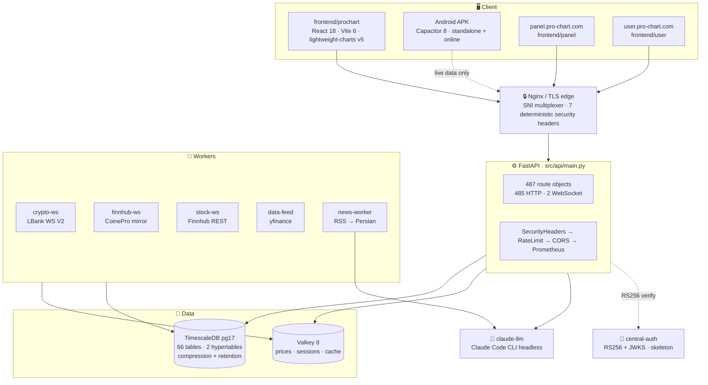
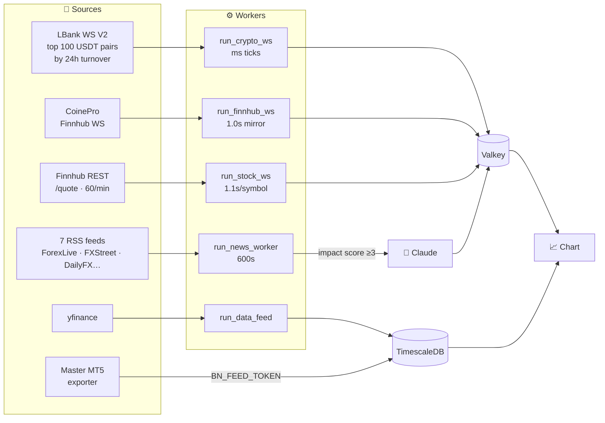
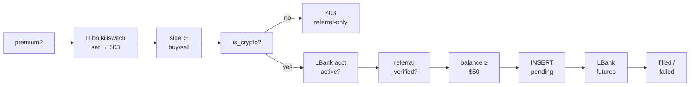

<div align="center">


<br>

**A Persian-first, right-to-left trading terminal — charting, analysis, and execution, built for the people TradingView never localized for.**

<br>

[](docs/EXECUTION_STATE.md)
[](docs/03_REQUIREMENTS_MATRIX.csv)
[](Dockerfile)
[](frontend/prochart/package.json)
[](#-license--disclaimer)

<br>

### 🌐 &nbsp; **English** &nbsp;·&nbsp; [فارسی](README.fa.md)

<br>


</div>

<br>

> [!IMPORTANT]
> **Read the status section before evaluating this repo.** Pro-Chart is under active construction at **Phase 0 (Baseline)** — 6 of 162 requirements are formally `VERIFIED`, the Python test suite is red, and the performance gate fails. The charting engine is deep and real; the surrounding platform is not finished. This README documents what the code *does*, not what a pitch deck would claim. Every number below is traceable to a file.

<br>

## 📖 Table of contents

<table>
<tr><td>

- [What this is](#-what-this-is)
- [The crown jewels](#-the-crown-jewels)
- [Architecture](#-architecture)
- [Data flow](#-data-flow)
- [Tech stack](#-tech-stack)

</td><td>

- [The chart engine](#-the-chart-engine)
- [NamaScript](#-namascript--نمااسکریپت)
- [Indicators](#-indicators-108)
- [Drawing tools](#️-drawing-tools-100)
- [Trading & compliance](#️-trading--compliance)

</td><td>

- [Security](#-security)
- [Project status](#-project-status-honest)
- [Getting started](#-getting-started)
- [Repository layout](#-repository-layout)
- [Roadmap](#-roadmap--i0i8)

</td></tr>
</table>

<br>

## 🎯 What this is

**Pro-Chart** (Persian: **بازارنما**, *bāzārnamā* — "market-shower") is a trading and technical-analysis platform whose founding constraint is unusual: **Persian is not a translation layer, it is the substrate.**

The entire UI is right-to-left. The documentation, code comments, help system, and error messages are Persian. The fonts are self-hosted Persian typefaces. The `<html>` element is hard-pinned to `lang="fa" dir="rtl"` and *never* leaves it — even when a user switches the interface to English, only `<body>` and `#root` follow, so public metadata stays Persian by contract.

The product goal, quoted from [`docs/01_PROCHART_MASTER_SPEC_FA.md`](docs/01_PROCHART_MASTER_SPEC_FA.md):

> ساخت بهترین سامانه تحلیل و معامله برای فارسی‌زبانان … در سطحی بالاتر از TradingView
>
> *"Build the best analysis and trading system for Persian speakers — at a level above TradingView."*

Three domains, one codebase:

| Domain | Serves | Source |
|---|---|---|
| `pro-chart.com` | The chart terminal + `/api` | `frontend/prochart/` · `src/api/` |
| `panel.pro-chart.com` | Admin panel | `frontend/panel/` |
| `user.pro-chart.com` | User portal | `frontend/user/` |

**Markets:** crypto via **LBank**, forex/metals/indices via **OneRoyal (MT5)** data, stocks/ETFs via **Finnhub + yfinance**.

<br>

## 💎 The crown jewels

These are the parts worth reading the source for. Each one is real, verifiable engineering — not a roadmap item.

<br>

<details open>
<summary><b>🧬 &nbsp;Two independent script engines, both sandboxed in Web Workers</b></summary>

<br>

**NamaScript** (نمااسکریپت) is the in-house Pine Script analogue. It ships as **two separate runtimes with identical output contracts** — a genuinely unusual design:

| Engine | File | Model | Why it exists |
|---|---|---|---|
| **Vectorized** | [`namascript.js`](frontend/prochart/src/bazaarnama/namascript.js) (240 lines) | Every series is an array. `ta.*` returns arrays. The body executes **once**, element-wise. | Fast. Good for indicators where the whole history is known. |
| **Bar-by-bar VM** | [`namascript_bar.js`](frontend/prochart/src/bazaarnama/namascript_bar.js) (420 lines) | The body executes **once per candle, left to right**. A `Series` class holds `hist[]` + `cur` so `s.get(n)` is the history operator. | True Pine semantics. Required for `var`/`varip`, `:=` reassignment, and `barstate.*`. |

The bar-by-bar VM solves a subtle problem correctly: **Pine gives every `ta.sma(...)` call site its own independent rolling state.** The VM implements this with per-call-site persistent `TA_STATE` — the thing most Pine clones get wrong.

Both are **drop-in replacements for each other**. They emit the same 15 buckets: `plots, shapes, hlines, bgs, labels, alerts, inputs, zones, fills, lines, boxes, tables, barcolors, candleplots, strategy`.

Both run user code in a **Web Worker with no DOM, no network, and a timeout** — the sandbox is structural, not advisory.

</details>

<details>
<summary><b>🔤 &nbsp;A hand-written recursive-descent parser for spread symbols</b></summary>

<br>

[`symbolExpr.js`](frontend/prochart/src/bazaarnama/symbolExpr.js) (109 lines) implements TradingView-style synthetic symbols — `EURUSD/GBPUSD`, `XAUUSD*2`, `US30-US500`, `(BTCUSDT+ETHUSDT)/2` — with a **tokenizer plus a real recursive-descent parser** (`parseExpr` → `parseTerm` → `parseFactor`) producing an AST. No `eval`, no dependency.

The detail that shows care: `computeSpread()` evaluates the expression **independently on each of open/high/low/close**, then sets

```js
high = max(the four computed corners)
low  = min(the four computed corners)
```

…because when a *ratio* inverts, the naive `high/high` and `low/low` mapping produces `high < low` and the chart breaks. That is a bug most implementations ship.

</details>

<details>
<summary><b>🎨 &nbsp;A custom lightweight-charts v5 rendering Primitive</b></summary>

<br>

[`bandFill.js`](frontend/prochart/src/bazaarnama/bandFill.js) (76 lines) is not a wrapper — it's a real **`BandFillPrimitive` + `BandFillPaneView` + `BandFillRenderer`** implementing lightweight-charts v5's Primitive interface, at `zOrder: 'bottom'` in media coordinate space.

It fills the region between two lines (Bollinger/Keltner bands, Ichimoku cloud). When `colorDown` is supplied it splits the region into sub-segments coloured by `upper >= lower` — which is how the Ichimoku cloud flips colour at the crossover.

The whole thing is wrapped in `try/catch` so the worst possible failure is *a missing fill*, never a crashed chart.

</details>

<details>
<summary><b>📊 &nbsp;A volume profile that distributes volume the way TradingView actually does</b></summary>

<br>

[`volumeProfile.js`](frontend/prochart/src/bazaarnama/volumeProfile.js) (37 lines, zero imports) spreads each candle's volume **uniformly across every price bucket its high–low range spans** — not just into the bucket containing the median. It computes the **POC** (max-volume bucket) and the **70% Value Area** by bidirectional expansion that always takes the heavier neighbour first.

For volume-less instruments (forex) it sets `w = 1` per candle, degrading gracefully into a **TPO / bar-count profile** instead of rendering nothing.

Zero imports means it is directly Node-testable — see [`test/volumeProfile.test.mjs`](frontend/prochart/test/volumeProfile.test.mjs).

</details>

<details>
<summary><b>🤖 &nbsp;Claude Code CLI as an LLM sidecar — 80 lines, zero npm dependencies</b></summary>

<br>

[`llm_service/`](llm_service/) is an HTTP wrapper around the **Claude Code CLI running headless**, authenticated by the host's Max subscription rather than per-token API billing. It spawns `claude -p <prompt> --output-format json --model <model>` and returns the result. It uses only Node's built-in `http` and `child_process` — **no npm dependencies at all**.

The clever bit: when a `system` prompt is supplied it appends `--system-prompt` **plus `--exclude-dynamic-system-prompt-sections`**, making the system prompt a *total replacement*. Claude Code's default "coding assistant" identity is removed entirely, so a role like *"financial-market expert"* applies cleanly with no residue.

The Python client ([`src/llm/client.py`](src/llm/client.py)) is built on one principle stated in its docstring — **safe degradation**: on error, timeout, or feature-flag-off it returns `None` and the caller falls back to the non-LLM path. It never blocks and never breaks the main path.

</details>

<details>
<summary><b>⛓️ &nbsp;Trustless USDT payment verification with no API key</b></summary>

<br>

[`_bsc.py`](src/api/routes/_bsc.py) (80 lines) verifies subscription payments **directly against the BSC chain** through four public RPCs with fallback — no Etherscan key, no third-party payment processor, no trust.

`verify_usdt_payment()` fetches the receipt, requires `status == 0x1`, then scans the logs for one where **all three** hold:

- `address == 0x55d398326f99059ff775485246999027b3197955` (Binance-Peg BSC-USD)
- `topics[0] == 0xddf252ad...` (the `Transfer(address,address,uint256)` signature)
- the last 20 bytes of `topics[2]` == our wallet

…then decodes `data` and divides by **1e18**. That last constant is the trap: BSC-USD has **18** decimals, unlike TRC20/ERC20 USDT's **6**. Getting it wrong by 10¹² is a silent, catastrophic bug — and the code has it right.

</details>

<details>
<summary><b>🧪 &nbsp;A QA harness with sealed, tamper-evident evidence</b></summary>

<br>

The [`qa/`](qa/) tree treats test output as **evidence**, not logs. From [`qa/README.md`](qa/README.md):

- Canonical runs happen in a pinned container (`mcr.microsoft.com/playwright:v1.61.0-noble`) with a **read-only repo mount**.
- `forbidOnly: true`, **`retries: 0`**, `workers: 1` — no flakiness laundering.
- Exactly **one** non-idempotent request is allowlisted (`POST /api/academy/auth/bn-guest`). Any other network write is a failure.
- **No storage or cookie *values* are ever written to artifacts** — key names and cookie metadata only; query-string values redacted.
- Artifacts are sealed with `SHA256SUMS`.

And the rule that makes the rest mean something:

> retry، exclusion یا mask برای سبزکردن Gate ممنوع است.
>
> *"Retry, exclusion, or masking to turn a gate green is forbidden."*

</details>

<br>

## 🏗 Architecture



The canonical stack is [`docker-compose.prochart.yml`](docker-compose.prochart.yml) — **11 services**, project name `prochart`, every service resource-limited.

> [!NOTE]
> **Two overlapping compose files exist.** `docker-compose.yml` is the legacy ~40-service CoinePro FX stack (Prometheus, Grafana, Loki, MediaMTX, coturn, MLflow, Prefect…). It has missing build contexts and is **not** the Pro-Chart deployment path. Use `deploy.sh`, not `make`. This overlap is a known structural gap, documented in [`docs/ARCHITECTURE.md`](docs/ARCHITECTURE.md).

**Two service-naming subtleties worth knowing:**

- The service named `redis` runs **Valkey 8**, not Redis. It is deliberately named `redis` so application code and `.env` need no change.
- The service named `finnhub-ws` **opens no Finnhub connection**. It mirrors forex prices from the sibling CoinePro service at 1s intervals, because a second Finnhub WS would collide on the API key. Single source, mirrored.

<br>

## 🌊 Data flow



<details>
<summary><b>Redis/Valkey key map</b></summary>

<br>

| Key | Written by | TTL | Contents |
|---|---|---|---|
| `bn:cprice:{SYM}` | `run_crypto_ws` | 60s | `{bid, ask, mid, ts}` from LBank WS |
| `price:{SYM}` | `run_finnhub_ws` | — | forex/metals/indices, `source="finnhub"` |
| `price:{SYM}` | `run_stock_ws` | 120s | stocks/ETFs + `prevClose`, `source="finnhub-stock"` |
| `bn:crypto_top100` | `run_crypto_ws` | — | set, for catalog trimming |
| `bn:fxsyms` | `POST /feed/forex` | — | set of forex symbols |
| `bn:news` | `run_news_worker` | 7200s | Persian summaries |
| `bn:calendar` | `run_news_worker` | 21600s | economic calendar, translated |
| `bn:killswitch` | admin | — | **presence halts all execution (503)** |
| `bn:cbal:{sid}` | `bn_gate` | 60s | cached LBank balance |
| `token_blacklist:{jti}` | `/auth/logout` | — | revoked JWTs |

**The news pipeline has a nice property:** if Claude translation fails, it **keeps the previous cache** rather than degrading to English. A stale Persian summary beats a fresh foreign one.

</details>

<br>

## 🛠 Tech stack

<table>
<tr><th align="left">Layer</th><th align="left">Choice</th><th align="left">Notes</th></tr>
<tr><td><b>Chart</b></td><td><code>lightweight-charts</code> v5</td><td>+ a custom rendering Primitive</td></tr>
<tr><td><b>Frontend</b></td><td>React 18.3 · Vite 6 · Zustand 5 · TanStack Query 5</td><td>Tailwind 3.4, no component library — everything hand-built</td></tr>
<tr><td><b>Mobile</b></td><td>Capacitor 8 · native biometric</td><td>APK built in CI, standalone + online</td></tr>
<tr><td><b>API</b></td><td>FastAPI 0.139 · Starlette 1.3 · uvicorn</td><td>487 route objects, 2 workers</td></tr>
<tr><td><b>Runtime</b></td><td>Python 3.13.14 (digest-pinned image)</td><td><code>pyproject.toml</code> targets 3.12+; the image is 3.13</td></tr>
<tr><td><b>ORM</b></td><td>SQLAlchemy 2.0 async · asyncpg · Alembic</td><td>66 models · 41 linear migrations · head <code>041_bn_ai_signals</code></td></tr>
<tr><td><b>DB</b></td><td>TimescaleDB pg17</td><td>hypertables on <code>candles</code>+<code>ticks</code>; 30d compression, 2y retention</td></tr>
<tr><td><b>Cache</b></td><td>Valkey 8</td><td>1gb, allkeys-lru, appendonly, requirepass</td></tr>
<tr><td><b>Auth</b></td><td>PyJWT · bcrypt · Fernet</td><td>RS256 central-first → HS256 fallback</td></tr>
<tr><td><b>LLM</b></td><td>Claude Code CLI headless</td><td>80-line sidecar, zero npm deps</td></tr>
<tr><td><b>TA</b></td><td>TA-Lib 0.7 · NumPy 2.2 · pandas 2.2</td><td>backend; the frontend registries are independent JS</td></tr>
<tr><td><b>QA</b></td><td>Playwright 1.61 · axe-core 4.10 · pytest</td><td>desktop 1440×900 + mobile 390×844</td></tr>
</table>

<br>

## 📈 The chart engine

[`frontend/prochart/src/pages/BazaarNama.jsx`](frontend/prochart/src/pages/BazaarNama.jsx) is **4,084 lines** composing ~45 modules. It stays **permanently mounted** in [`AppShell.jsx`](frontend/prochart/src/app/AppShell.jsx) — every other screen overlays it, so the chart never re-initializes.

### Chart types

**Standard:** candles · hollow candles · bars · line · area · baseline · step · HLC area · columns · high-low · line-with-markers · volume candles · Heikin-Ashi

**Non-standard** (rebuilt from raw candles in [`chartbuilders.js`](frontend/prochart/src/bazaarnama/chartbuilders.js)): **Renko · Range · Line Break · Kagi · Point & Figure**

### Capabilities

<table>
<tr><td width="50%" valign="top">

**Analysis**
- 108 indicators across 3 registries
- ~100 drawing tools, chart-space anchored
- Multi-timeframe (`mtfEma`, `mtfRsi`)
- Divergence, harmonic patterns, gaps
- Volume profile with POC + 70% VA
- TradingView Technical Rating (15 MAs + 13 oscillators)
- Spread/ratio symbols via AST

</td><td width="50%" valign="top">

**Workflow**
- Historical **Replay** with speed ladder
- Strategy tester in the bottom dock
- Layout presets: 1 / 2h / 2v / 3 / 4 / 6 / 8 with a sync bus
- Alert builder: source × operator × trigger × expiry × delivery
- Screener · Details · News · Calendar panels
- Undo/redo, multi-select (`Ctrl+click`), per-tool default styles
- Declarative hotkey registry

</td></tr>
</table>

### Derived timeframes — and the bug that shaped them

[`resample.js`](frontend/prochart/src/bazaarnama/resample.js) builds M2/M3/H2/H3/W1/MN from base candles. It uses **two different strategies**, and the comment explains exactly why:

```js
// intraday (base < 86400s): boundary-aligned bucketing
Math.floor(t / bucket) * bucket
```

Index-counted bucketing anchored H2/H3 to *the first fetched candle*, producing odd hours that **drifted as you scrolled**. Boundary alignment fixes it.

But for daily bases (W1 = D1×5, MN = D1×22) it **stays index-counted** — because "5 trading days = 1 week" must survive weekend gaps, which timestamp-alignment would break.

<br>

## 🧬 NamaScript — نمااسکریپت

The in-house scripting language. Persian keywords, Pine-compatible semantics, two interchangeable runtimes.

<details>
<summary><b>Built-ins verified in source</b></summary>

<br>

**`ta.*`** — `sma · ema · rma · wma · hma · vwma · vwap · stdev · change · mom · roc · highest · lowest · rsi · tr · atr · cci · macd · bb · stoch · supertrend`

**Signals** — `crossover · crossunder · cross · rising · falling · barssince · valuewhen · ref`

**Bar-by-bar engine only** — `var` · `varip` · `x := expr` · `close[1]` · `expr[n]` · `barstate.isfirst / islast / isnew / isconfirmed / ishistory` · `na` · `nz`

**Output buckets (both engines)** — `plots · shapes · hlines · bgs · labels · alerts · inputs · zones · fills · lines · boxes · tables · barcolors · candleplots · strategy`

Supporting files: [`CodeEditor.jsx`](frontend/prochart/src/bazaarnama/CodeEditor.jsx) (295) · [`scriptlib.js`](frontend/prochart/src/bazaarnama/scriptlib.js) (711 — examples + reference) · [`help/namascript.js`](frontend/prochart/src/bazaarnama/help/namascript.js) (924 — language docs)

</details>

<br>

## 📐 Indicators (108)

Three registries merged at [`indicators.js:554`](frontend/prochart/src/bazaarnama/indicators.js) via `Object.assign(REGISTRY, EXT_REGISTRY_A, EXT_REGISTRY_B)`. The arithmetic is 52 + 16 + 43 = 111, but `trix`, `bbpercent`, and `bbw` appear in both extensions, so the **merged registry holds 108 distinct indicators** — that is `Object.keys(REGISTRY).length`, verified at runtime, not counted by hand.

<details>
<summary><b>Core registry — 52 surviving keys</b> &nbsp;·&nbsp; <code>indicators.js</code></summary>

<br>

`ma` `ema` `wma` `hma` `vwap` `avwap` `choppiness` `vortex` `dpo` `bop` `eom` `elderRay` `chandeKroll` `massIndex` `coppock` `kst` `alligator` `rvi` `bbWidth` `stc` `netVolume` `stdErrBands` `accelerator` `chaikinVol` `mtfEma` `mtfRsi` `bb` `supertrend` `rsi` `macd` `stoch` `atr` `cci` `willr` `obv` `adx` `donchian` `keltner` `ichimoku` `dema` `tema` `vwma` `psar` `pivots` `aroon` `mfi` `cmf` `stochrsi` `ao` `tsi` `cmo` `alma` `maRibbon` `gmma` `maCross`

</details>

<details>
<summary><b>Extension A — 16</b> &nbsp;·&nbsp; <code>indicators_ext_a.js</code></summary>

<br>

`smma` `zlema` `kama` `t3` `mcginley` `linreg` `lsma` `trix` `bbpercent` `bbw` `stddev` `envelopes` `hv` `chaikinVol` `dmi` `ppo`

</details>

<details>
<summary><b>Extension B — 43</b> &nbsp;·&nbsp; <code>indicators_ext_b.js</code></summary>

<br>

`aroonOsc` `pvo` `adr` `median` `typicalPrice` `weightedClose` `woodiesCci` `pmo` `pvi` `nvi` `rviVol` `mom` `chandelier` `volatilityStop` `ulcer` `roc` `trix` `ac` `uo` `fisher` `crsi` `smiErgodic` `smi` `bop` `bbpercent` `bbw` `volume` `adline` `chaikinOsc` `eom` `forceIndex` `klinger` `pvt` `volumeOsc` `pivotsMulti` `pivotHL` `fractals` `candlePatterns` `zigzag` `autoFib` `srLevels` `supplyDemand` `linRegChannel`

</details>

> **A note on numerical care.** [`indicators.js:349`](frontend/prochart/src/bazaarnama/indicators.js) documents that `dema`/`tema` previously mapped `null → 0`, seeding the nested EMAs with fake zeros and making roughly **90 initial bars badly wrong**. The comments in this file consistently record *the bug that motivated the fix*, not just the fix. [`techRating.js`](frontend/prochart/src/bazaarnama/techRating.js) cites live-TradingView-parity issues **#263/#264/#265** — e.g. ADX is crossover-based, not `ADX > 20`, and VWMA drops out on volume-less forex so `maTot` becomes 14 rather than 15.

<br>

## ✏️ Drawing tools (~100)

[`drawings.js`](frontend/prochart/src/bazaarnama/drawings.js) (801) renders a Canvas overlay in **chart-space** (`{t: unix, p: price}`), so drawings stay locked to the data under zoom and pan. [`drawtools_ext.js`](frontend/prochart/src/bazaarnama/drawtools_ext.js) (970) adds 43 more as a strictly additive registry — each tool is **three pure functions** over a coordinate API.

<details>
<summary><b>All groups</b></summary>

<br>

| Group | Tools |
|---|---|
| **Cursors** | cursor · select · eraser |
| **Lines** | trend · ray · infoline · extline · angle · hline · hray · vline · crossline |
| **Channels & Pitchforks** | channel · regchannel · disjointchannel · flatchannel · pitchfork · schiff · modschiff · insidepitchfork · pitchfan |
| **Fibonacci** | fib · fibext · fib3 · fibfan · fibtime · fibtimeext · fibchannel · fibcircles · fibarcs · fibspiral · fibwedge |
| **Gann** | gannbox · gannsquare · gannfan · gannfixed |
| **Patterns** | xabcd · cypher · abcd · tripattern · threedrives · hns · ell_impulse · ell_triangle · ell_wxyxz · ell_abc · ell_wxy |
| **Projection & Measure** | longshort · short · pricerange · daterange · dprange · forecast · ruler · cyclic · sine · projection · timecycles |
| **Shapes** | rect · rotrect · circle · ellipse · triangle · arrow · brush · polyline · path · curve · doublecurve · arc · highlighter |
| **Annotations** | text · callout · pricelabel · note · arrowdir · flag · signpost · arrowup · arrowdown |

</details>

> [!NOTE]
> From the header of `drawtools_ext.js`:
>
> > هیچ کد یا داراییِ اختصاصیِ TradingView استفاده نشده؛ همهٔ فرمول‌ها بازپیاده‌سازی شده‌اند
> >
> > *"No proprietary TradingView code or assets are used; every formula is reimplemented."*

<br>

## ⚖️ Trading & compliance

This is the section where a README usually oversells. Here is what actually executes.

### Crypto — LBank

**The only live execution path**, and it sits behind a feature flag that defaults to **off** (`BN_CRYPTO_EXEC_ENABLED`).

Orders run on **the user's own LBank API key** — never a master account. The gate chain in [`bazaarnama.py::real_order`](src/api/routes/bazaarnama.py) is strict, and every attempt is persisted to `bn_orders` regardless of outcome:



Server-side clamping in [`bn_gate.py`](src/api/routes/bn_gate.py) locks 23 copy-settings fields: leverage 1–125, amount $5–100k, `margin_mode` **locked** to `ISOLATED`, `order_price_type` **locked** to market, `product_group` **locked** to `SwapU`. `api_key`/`api_secret` are explicitly skipped — they only arrive via `POST /connect/lbank`.

### Forex — OneRoyal is **referral-only**

> [!WARNING]
> **No forex order can be placed through this system.** Execution was deliberately removed and is protected by **five independent locks**. Read this before assuming otherwise.

| # | Lock | Where |
|---|---|---|
| 1 | `COPY_LIVE_ENABLED = False` with a `field_validator` named `_lock_copy_live_off` that **hard-returns `False`** — *"legacy env values must never reopen the OneRoyal execution adapter."* **You cannot re-enable it from `.env`.** | `src/core/config.py` |
| 2 | `real_order` rejects any non-crypto symbol with **403** — *"no non-crypto order enters the DB or the execution queue."* | `src/api/routes/bazaarnama.py` |
| 3 | `GET /copytrade/forex/settings` returns a stub with no MT5 lookup; `POST` → **403** | `src/api/routes/bn_gate.py` |
| 4 | Every EA settings path → **410 Gone**. The router isn't even mounted. | `src/api/routes/ea.py` |
| 5 | `MetaTrader5` is commented out of `requirements.txt`; `mt5_connector.py` is in coverage's omit list | `requirements.txt` |

A dedicated regression test — [`qa/python/legacy_forex_referral_boundary_regression.py`](qa/python/legacy_forex_referral_boundary_regression.py) — asserts this boundary holds.

**What forex still does:** analysis is fully independent of broker integration. Data arrives via `POST /academy/bn/feed/forex` from a master MT5 exporter (authenticated with `hmac.compare_digest`), plus the `run_finnhub_ws` mirror. Users get a **48h one-shot trial**, then need a subscription.

### Referral surfaces

The only surviving OneRoyal surface is [`referrals.py`](src/api/routes/referrals.py) — deliberately **non-parameterised** fixed redirects. Its docstring states a request cannot supply or override a destination, the response is never cached (`Cache-Control: no-store`), and future referral analytics **must not** record headers, query strings, or credentials.

| Route | Destination |
|---|---|
| `/go/lbank` | `https://www.lbank.com/ref/PROCHART` |
| `/go/oneroyal` | `https://vc.cabinet.oneroyal.com/fa/links/go/12412` |

`REFERRAL_DISCLOSURE` and `REFERRAL_ELIGIBILITY` constants carry the affiliate-credit and residency-eligibility disclosures.

<br>

## 🔒 Security

<table>
<tr><td width="50%" valign="top">

**Fail-secure by construction**
- **Admin auth**: if Redis is unreachable, the token-blacklist check raises **503 rather than allowing the token** — an explicit comment notes this prevents exploiting a Redis outage
- **Lifespan**: the app **refuses to start** without both DB and Redis
- **`/health`**: fail-closed **503** in production (200 only when healthy or `DEBUG`)
- **`/docs`**: `docs_url = None` unless `DEBUG` — no OpenAPI UI in production
- **`/metrics`**: `Depends(get_current_admin)`
- **Config**: a `model_validator` **raises at import time** in production on weak `DB_PASSWORD` / `JWT_SECRET_KEY` / `ADMIN_PASSWORD`

</td><td width="50%" valign="top">

**Defense in depth**
- Credentials **Fernet-encrypted** at rest — the DB never holds plaintext
- Rate limiting per-IP-per-path: 240/60s default; `/auth/login` **5/60s**
- CORS is **never `"*"`** — production origins derived from configured domains
- CSP `default-src 'none'` on the API; `'self'` at the edge, **no `unsafe-eval`**
- 7 deterministic headers re-added at the edge after `proxy_hide_header`
- Container runs as **non-root** `USER 1000:1000`
- Base images **digest-pinned**; `pip check` + import smoke test at build
- gitleaks + bandit + Trivy + hadolint + pip-audit

</td></tr>
</table>

> [!CAUTION]
> **Open security gaps — stated plainly.** [`docs/security/SECURITY_REPORT.md`](docs/security/SECURITY_REPORT.md) records the release gate as **`FAIL`**.
>
> - **`PC-132` (secret rotation/revoke) is `FAIL`** — baseline git *history* still contains 1 generic API key finding. The report's own words: *"exposure قبلی با حذف artifact خنثی نمی‌شود"* — **prior exposure is not neutralized by deleting the artifact.**
> - Supply chain: **8,971 components**, 817 applicable, including **29 Critical / 73 High**. Unsigned, unattested.
> - The strict current-source scan (1,282 files) is **0 findings / PASS** — but it explicitly excludes history, ignored files, and runtime stores.
> - `ci/security-workflow.yml` is **not active** (it lives outside `.github/workflows/`), and nearly every step ends in `|| true` — **non-blocking by design**.
>
> One more, worth flagging for anyone deploying: [`src/core/crypto.py`](src/core/crypto.py) derives the Fernet key from `sha256(JWT_SECRET_KEY)` if `USER_CREDS_ENC_KEY` is unset. **Rotating `JWT_SECRET_KEY` without setting `USER_CREDS_ENC_KEY` would make every stored credential permanently undecryptable.**

<br>

## 📊 Project status (honest)

Pro-Chart is at **Phase 0 — Baseline**. [`docs/EXECUTION_STATE.md`](docs/EXECUTION_STATE.md), as of `2026-07-15T08:53:08Z`:

<table>
<tr><th align="left">Gate</th><th align="left">Result</th><th align="left">Detail</th></tr>
<tr><td><b>Requirements</b></td><td>🔴 <b>6 / 162 VERIFIED</b></td><td>P0 = 85, P1 = 77. Verified: PC-030, PC-118–122</td></tr>
<tr><td><b>G0 gate</b></td><td>🔴 <b>NOT PASSED</b></td><td><code>docs/BASELINE_INVENTORY.md</code></td></tr>
<tr><td><b>Python tests</b></td><td>🔴 <b>FAIL</b></td><td>227 passed · <b>50 failed</b> · 32 errors · 0 skipped</td></tr>
<tr><td><b>JS tests</b></td><td>🟢 PASS</td><td>ProChart 18/18 · Panel 5/5 (focused, not full-system)</td></tr>
<tr><td><b>A11y (mobile matrix)</b></td><td>🟢 PASS</td><td>5/5 · 0 WCAG violations · 163 contrast nodes <i>incomplete</i></td></tr>
<tr><td><b>Visual</b></td><td>🟡 PARTIAL</td><td>3 PNGs byte-identical across runs · <b>approved goldens = 0</b></td></tr>
<tr><td><b>Performance</b></td><td>🔴 <b>FAIL</b></td><td>LCP desktop 4344ms / mobile 4188ms (target ≤2500) · frame 28ms (target &lt;20)</td></tr>
<tr><td><b>Security headers</b></td><td>🟢 PASS</td><td>isolated candidate 10/10 · ZAP High=0, Medium=3</td></tr>
<tr><td><b>Supply chain</b></td><td>🔴 <b>FAIL</b></td><td>29 Critical · 73 High · unsigned/unattested</td></tr>
<tr><td><b>SLOs</b></td><td>⚪ <b>DRAFT / NOT ENFORCED</b></td><td>No RUM. Error budget <code>NOT_DEFINED</code></td></tr>
</table>

The owner's own estimate, quoted in the handoff doc: **~۵٪ راه رفته شده؛ ۹۵٪ مانده** — *"~5% of the road walked; 95% remains."*

**Why the failures are visible instead of hidden.** [`docs/SLO.md`](docs/SLO.md) sets the rule:

> نبود telemetry … نتیجه `NOT_MEASURED` است، نه `PASS`
>
> *"Absence of telemetry yields `NOT_MEASURED`, not `PASS`."*

Rounding, hidden retries, outlier removal, and averaging mobile with desktop to reach green are all **explicitly forbidden**. The 50 failing Python tests are *preserved, not skipped*. That is a deliberate engineering-culture choice, and it is why the table above is worth trusting.

<details>
<summary><b>Known structural gaps — from <code>docs/ARCHITECTURE.md</code> and verified in source</b></summary>

<br>

- `BazaarNama.jsx` exceeds **4,000 lines**; module boundaries are not build-enforced
- **60 endpoints** across `admin_instagram.py`, `ea.py`, `trade_history.py` are **unmounted**, pending ownership/collision/auth decisions
- **Six frontends and two overlapping compose files**, with no single build/release path
- **Five packages lack lockfiles** — reproducible build is unproven
- `make migrate` uses `create_all`/manual SQL, **not** canonical `alembic upgrade head`
- `frontend/prochart/package.json` still declares `"name": "coinepro-academy"` — a fork leftover
- `frontend/admin/` is a **stub with no `package.json`**; the real admin panel is `frontend/panel/`
- Celery's `include` list references `src.copy.tasks` and `src.ml.ensemble` — **neither exists**. Celery is not in the prochart stack.
- `CLAUDE.md` points at `docs/SERVER-HANDOFF.md`, which was **deleted** in `62eabe8`
- `src/signals`, `src/ml`, `src/risk`, `src/analysis` are **largely stubs** — `signals/engine.py` is 3 lines, `ml/trainer.py` is 6. XGBoost/LightGBM/Optuna are in `requirements.txt`, but **the engine that would use them is not in this repo.** Do not read this as a working ML pipeline.
- Bazaarnama — the flagship — is served under **`/academy/bn/*`**, a legacy path from when it lived inside the CoinePro academy

</details>

<br>

## 🚀 Getting started

> [!TIP]
> Use **`deploy.sh`**, not `make`. The `Makefile` targets the legacy `docker-compose.yml` — its `logs-bot` / `logs-engine` reference services that exist only in the old stack, and `db-shell` uses a different database name.

```bash
git clone https://github.com/BehnamJalali-Co/Pro-Chart.git
cd pro-chart

cp .env.example .env      # 53 keys — see below
```

<details>
<summary><b>Required environment (the ones that will bite you)</b></summary>

<br>

| Key | Why it matters |
|---|---|
| `JWT_SECRET_KEY` | Must be ≥32 chars and non-default, or **config raises at import time** in production |
| `DB_PASSWORD` · `REDIS_PASSWORD` · `ADMIN_PASSWORD` | Same validator — known-weak values **hard-fail** the boot |
| `USER_CREDS_ENC_KEY` | **Set this.** Unset ⇒ the Fernet key is derived from `sha256(JWT_SECRET_KEY)`, coupling credential decryption to your JWT secret forever |
| `BN_CRYPTO_EXEC_ENABLED` | `0`/unset ⇒ crypto execution disabled (the safe default) |
| `FINNHUB_API_KEY` | Unset ⇒ `run_stock_ws` exits early; stocks show no live quotes |
| `BN_FEED_TOKEN` | Shared secret for the master MT5 forex exporter |
| `CLAUDE_CODE_OAUTH_TOKEN` | The `claude-llm` sidecar; unset ⇒ LLM features degrade to `None`, safely |

</details>

```bash
# whole stack
docker compose -p prochart -f docker-compose.prochart.yml up -d

# migrations — canonical path
docker compose -p prochart -f docker-compose.prochart.yml exec api alembic upgrade head

# deploy (also purges the Cloudflare edge if .cf is present)
bash deploy.sh --all
```

<details>
<summary><b>Frontend development</b></summary>

<br>

```bash
cd frontend/prochart
npm ci --legacy-peer-deps

npm run dev                                          # dev server
VITE_API_URL=https://pro-chart.com/api npm run build # production build
NO_OBF=1 npm run build                               # readable build for debugging
```

**Two build constraints you must respect** — both documented in `vite.config.js` and `CLAUDE.md`:

1. **No dynamic chunks. No `React.lazy`.** The app loads from local disk inside a Capacitor WebView, and obfuscated dynamic chunks sometimes don't land in the APK. `manualChunks: () => 'index'` enforces a single chunk.
2. **The obfuscator seed is fixed** (`20260709`). Random seeds caused TDZ `"Cannot access X before initialization"` errors. `controlFlowFlattening`, `deadCodeInjection`, and `debugProtection` are all deliberately **disabled** — each caused either black screens or main-thread stalls.

</details>

<details>
<summary><b>Running the tests</b></summary>

<br>

```bash
# Python — currently red by design (227 pass / 50 fail / 32 errors)
pytest tests/ -v

# Frontend numerical guards — bundle first, then run
cd frontend/prochart
npx esbuild src/bazaarnama/indicators.js --bundle --format=esm --outfile=test/.ind.bundle.mjs
node --test test/indicators.test.mjs

# QA harness — canonical run is containerized
cd qa && bash python/run-clean.sh
```

The 20 files in `frontend/prochart/test/` are **not wired to an npm script** — each needs its esbuild bundle step first. See `test/source.test.mjs:5-9` for the documented two-step.

</details>

<br>

## 📁 Repository layout

```
pro-chart/
├── src/                          # FastAPI backend — 235 files, ~26k lines
│   ├── api/
│   │   ├── main.py               # ⭐ app factory · middleware order matters
│   │   ├── deps.py               # get_db (commits at request end) · RBAC · fail-secure admin
│   │   └── routes/
│   │       ├── bazaarnama.py     # ⭐ 1,448 lines — the Bazaarnama core
│   │       ├── bn_gate.py        # gating · server-side clamping
│   │       ├── _bsc.py           # trustless USDT verification
│   │       ├── _lbank_futures.py # 1,138 lines — LBank futures client
│   │       ├── referrals.py      # fixed, non-parameterised redirects
│   │       └── ea.py             # ⚠️ unmounted · 410 Gone
│   ├── core/
│   │   ├── config.py             # 498 lines — one Settings, fails loudly
│   │   ├── database.py           # 1,356 lines — 66 models
│   │   └── crypto.py             # Fernet at rest
│   └── llm/client.py             # safe degradation → None
│
├── frontend/
│   ├── prochart/                 # ⭐ the flagship
│   │   ├── src/pages/
│   │   │   └── BazaarNama.jsx    # 4,084 lines · ~45 modules
│   │   ├── src/bazaarnama/       # the engine
│   │   │   ├── indicators*.js    # 108 across 3 merged registries
│   │   │   ├── namascript*.js    # 2 engines
│   │   │   ├── drawings.js       # chart-space canvas
│   │   │   ├── drawtools_ext.js  # +43 tools
│   │   │   ├── symbolExpr.js     # recursive-descent parser
│   │   │   ├── bandFill.js       # lightweight-charts v5 Primitive
│   │   │   ├── volumeProfile.js  # POC + 70% VA
│   │   │   ├── techRating.js     # 15 MAs + 13 oscillators
│   │   │   └── help/             # ~14k lines of Persian docs
│   │   └── test/                 # 20 offline numerical guards
│   ├── panel/                    # admin · the most modern stack
│   ├── user/                     # user portal
│   ├── website/ academy/ ig/     # legacy CoinePro FX
│   └── admin/                    # ⚠️ stub — no package.json
│
├── run_*.py                      # 8 workers · 5 in the prochart stack
├── llm_service/                  # 80 lines · zero npm deps
├── central-auth/                 # RS256 + JWKS · skeleton, not deployed
├── alembic/versions/             # 41 linear migrations
├── docs/                         # ⭐ spec (89KB, 42 §) · ADR · SLO · security
├── qa/                           # Playwright + axe · sealed evidence
└── docker-compose.prochart.yml   # ⭐ canonical · 11 services
```

<br>

## 🗺 Roadmap — I0…I8

The live governance model. (`M1..M8` appears in older docs and is **superseded** — `grep` finds zero hits in current `docs/`.)

```mermaid
flowchart LR
    I0["I0<br/>Baseline<br/>Evidence · Backup<br/>Threat model"] --> G0{"G0"}
    G0 --> I1["I1<br/>RTL/i18n · Design System<br/>Auth · CI"]
    I1 --> I15["I1.5<br/>LBank/OneRoyal<br/>CTA · Disclosure"]
    I15 --> I2["I2<br/>Data contracts<br/>Chart Core"]
    I2 --> I25["I2.5<br/>Advanced chart<br/>a11y overlay"]
    I25 --> I3["I3<br/>Indicators · Drawing<br/>Workspace"]
    I3 --> I4["I4<br/>Alert · Replay<br/>Backtest · Paper"]
    I4 --> I5["I5<br/>NamaScript<br/>sandbox + golden"]
    I5 --> I6["I6<br/>Screener · Heatmap<br/>AI · Voice"]
    I6 --> I7["I7<br/>LBank adapter<br/>OneRoyal scaffold"]
    I7 --> I8["I8<br/>Visual · Load · Soak<br/>Supply chain"]
    I8 --> G8{"G8"}
    G8 --> DONE["PC-004<br/>COMPLETE"]
```



**We are here:** I0, in progress. G0 **not passed**.

The state machine is `NOT_STARTED → BASELINING → BASELINED → IN_PROGRESS → EVIDENCE_READY → VERIFIED` (plus `BLOCKED`, `FAILED`, `WAIVED`), governed by one rule:

> ثبت `BASELINED` هرگز به معنی `VERIFIED` نیست.
>
> *"Recording `BASELINED` never means `VERIFIED`."*

<details>
<summary><b>The founding constraints — non-negotiable, from the spec</b></summary>

<br>

- UI fully Persian with true RTL. English only for brands, symbols, codes, and a whitelisted set of technical terms.
- **LBank is the only exchange.** Referral link exactly `https://www.lbank.com/ref/PROCHART`, via the internal `/go/lbank`.
- **OneRoyal is the only broker.** Exactly `https://vc.cabinet.oneroyal.com/fa/links/go/12412`, via `/go/oneroyal`.
- **سیاست عدم حذف** — no existing feature may be removed without a migration path, a feature flag, a regression test, **and** explicit owner approval.
- No dead CTAs. No permanent mocks. No secrets in the browser, logs, screenshots, or repo.
- **No guaranteed-profit claims.**

</details>

<br>

## 📄 License & disclaimer

**Proprietary.** No license file is present in this repository; all rights are reserved by the owner. This code is published for review and is not offered for reuse or redistribution.

**Third-party notice.** `lightweight-charts` is used under its own license. Every indicator and drawing-tool **formula** here is reimplemented from public descriptions — `drawtools_ext.js` states this rule and holds to it.

**Icons.** `src/bazaarnama/tvIcons.jsx` overrides 23 lucide icons with SVG path data taken from TradingView (its header comment says so plainly). The owner states this use is covered by an agreement with TradingView. It is tracked as **V-1** in [`docs/parity/TV_GAP_REGISTER.md`](docs/parity/TV_GAP_REGISTER.md) — as a *consistency* issue, not a licensing one: the app currently mixes two icon systems (lucide's 2px round strokes on a 24×24 grid beside TradingView's 1px filled 28×28).

> [!WARNING]
> **Financial risk.** This software is a technical-analysis and order-routing tool. It is **not** financial advice, and it makes **no guarantee of profit** — a constraint written into the product spec itself. Trading leveraged instruments carries substantial risk of loss. `TRADING_MODE` defaults to `paper` and crypto execution defaults to **off**; both are safe defaults, and both are your responsibility to change knowingly.
>
> **Affiliate disclosure.** `/go/lbank` and `/go/oneroyal` are referral links; the operator may receive affiliate credit. Broker eligibility is subject to residency restrictions — see `REFERRAL_DISCLOSURE` and `REFERRAL_ELIGIBILITY` in [`src/api/routes/referrals.py`](src/api/routes/referrals.py).

<br>

---

<div align="center">

<br>

**ساخته‌شده برای فارسی‌زبانان** &nbsp;·&nbsp; **Built for Persian speakers**

<sub>Every figure in this README is traceable to a file in this repository.<br>Where the code and the docs disagree, the code wins — and the disagreement is noted.</sub>

<br>

[](README.fa.md)
[](docs/01_PROCHART_MASTER_SPEC_FA.md)
[](docs/ARCHITECTURE.md)

</div>
